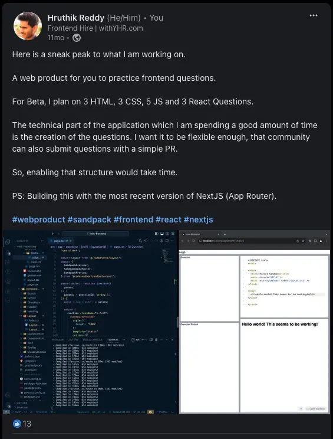
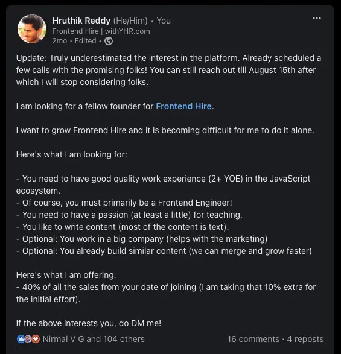
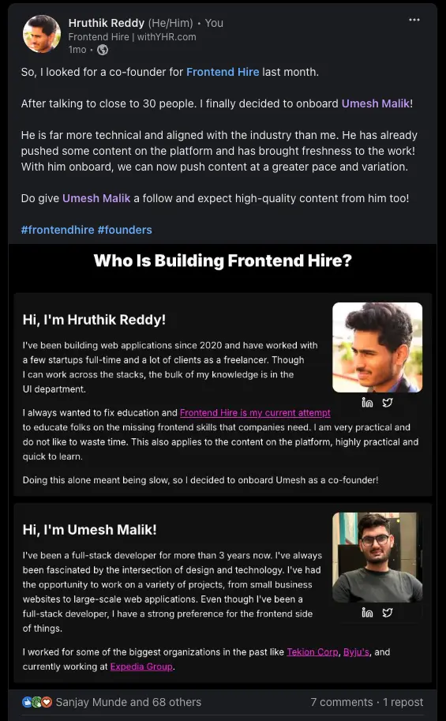

> TLDR: We thought we could make money. We are not making enough for the effort we put into it. So, rather than abandoning the project entirely, we decided to make it open source, allowing the community to benefit from and potentially build upon our work.

## 1. The part where I was having fun

I started this project for fun back in [October 2023](https://www.linkedin.com/posts/yarala-hruthik-reddy_webproduct-sandpack-frontend-activity-7119624768462413825-fPjt?utm_source=share&utm_medium=member_desktop). Here is a screenshot of a post I made on [LinkedIn](https://www.linkedin.com/in/yarala-hruthik-reddy/).

I was literally building this for pure fun and trying out the latest technologies such as [Sandpack](https://codesandbox.io/blog/announcing-sandpack-2) and [Web Containers](https://blog.stackblitz.com/posts/introducing-webcontainers/) to build out in-browser IDEs.

I was also actively trying out this **"build in public"** thing to grow my social network. So, I talked a lot about building it! I made a ton of connections in the process.

## 2. The part where I thought I could make money

With time, I realized that this could be a good source of income too. So, as I was also growing [my dev studio](https://withyhr.com/), I got all the payment integrations done and was ready to take payments.

In fact, even before I made the payments live on the platform, I did a post offering early-bird prices for the same. I didn't expect to make any sales, but to my surprise, I did make a few. Then I went live and didn't make any sales for the first two weeks.

I started pushing more content and soon started seeing frequent sales, even international ones. But the frequency was still not enough for me to give more of my time to this. Also, trust me, creating content is not easy. I could build the platform 10 times over, but creating high-quality content takes a lot of effort and is tiring as hell.

## 3. The part where I needed help

It was pretty much burnout trying to do this alone. This is also where I thought I would kill the product and focus on something else.

But instead, I decided to bring in someone to ease some of the effort. So, I made a post [looking for a co-founder](https://www.linkedin.com/posts/yarala-hruthik-reddy_update-truly-underestimated-the-interest-activity-7224431869042253825-IHbw?utm_source=share&utm_medium=member_desktop).

I got a ton of requests for the same. I blocked almost 8 days on my calendar to talk to these folks. I also got to know how many people loved the way I create content. This is where I was getting more optimistic about the project. After much discussion, I decided to go ahead with [Umesh Malik](https://www.linkedin.com/posts/yarala-hruthik-reddy_frontendhire-founders-activity-7240195741233614848-AhKk?utm_source=share&utm_medium=member_desktop) as the co-founder.

## 4. The part where people were loving it

Every time I felt like killing the project, people used to message me out of the blue supporting my work. It felt truly more purposeful than my usual work of putting some buttons here and there.

Here is what [one pro user said](https://www.linkedin.com/posts/yarala-hruthik-reddy_frontendhire-content-activity-7225436948289445888-qmjj?utm_source=share&utm_medium=member_desktop) about the project:

> Thank you for the discount, I really appreciate the work you’re putting in to frontendhire.
>
> I’ve been following your posts and they’re always reallly genuine and helpful. Such a breath of fresh air compared to all the other content out there.
>
> Wishing you the best and will be looking to support you further for all the projects you have coming up

What [another pro user said](https://www.linkedin.com/posts/yarala-hruthik-reddy_frontendhire-pro-activity-7242180369528070144-zai7?utm_source=share&utm_medium=member_desktop):

> Thank you.
>
> This is my first ever purchase related to learning/programming. I've never bought courses, ai helpers, not even leetcode subscriptions. Always learnt from documentation, mdn, articles, blogs and videos for free. But your inspiring work and depth of knowledge convinced me.
>
> Hope to learn a lot more in the future.

This kept me going for a few more days. Until I burned out completely.

## 5. The part where I burned out completely

Here's the thing: I could have slowed down and pushed content at any pace that felt comfortable and easy to me. But I came to a point where this was no longer fun. So, after a quick discussion with my co-founder, we decided to pivot.

I still want to solve the hiring problem, but from all the research I've done so far, it's not easy. All the attempts made by others to solve this problem seem more like trying to take a bit of market share with that **"Solve 3 tasks, Get Onboarded on the platform, Companies will reach out, etc."** approach.

So, unless I can think of something better, I won't be touching this problem again. Pivoting to something similar was out of the equation too.

## 6. The part where I actually still made quite a bit of money

> Weirdly, I made more money talking about Frontend Hire than from Frontend Hire itself.

That whole **"building in public"** thing actually works. I got a ton of clients and even a LinkedIn brand deal, all of which would not have been possible if I had not built the platform. This is where I decided to go back to day one and make this whole thing open-source and free for everyone.

## 7. The part where I work on making it open-source

I made quite a few mistakes while building this platform. But now I had the chance to fix them all before making it open-source.

- I decided to migrate to Astro since the majority of the platform is content-driven. I also cut down on unnecessary dependencies. Astro has first-class support for most of the things I needed.

- I decided to ditch the Sandpack experience for iframe embeds from Stackblitz or CodeSandbox. Since I had no commercial restrictions now, it also makes contribution much easier.

- No more authentication or database involved. The platform is fully static, super fast, and can be deployed literally anywhere.

## 8. The part where I try to keep current pro users happy

But wait, what should I do about the current users who gave me their money? I'm not entirely sure, but here are some ideas I can think of:

- Offer first-class support whenever they have any query.

- Give free access to any products I build in the future.

- Offer free sessions for further learning.

I have already started to focus on [the Discord community](https://discord.gg/DWAVqksVtx) and help as much as possible through more open-source-style projects.

## Post Script

I would also fork the new Frontend Hire repo, make some basic changes, and launch Backend Hire as a sister product too. I'll let the community drive this if they want.

I will still be pushing occasional content to Frontend Hire and maybe even Backend Hire, and try to encourage the community to contribute to these projects. I'll migrate the old content as soon as possible. But for me, this project is primarily dead, and I can't afford to spend much time or energy on it.

However, I had a ton of fun, learned a lot, and built a great network through this project. I hope you enjoyed it too.

_Thanks_

_- YHR_
