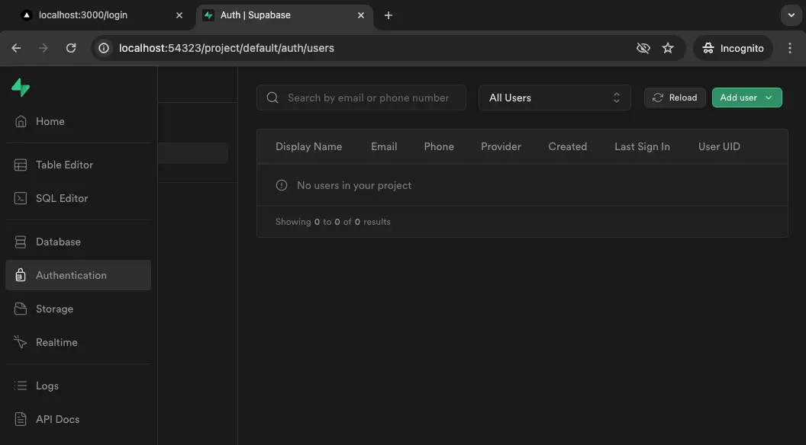
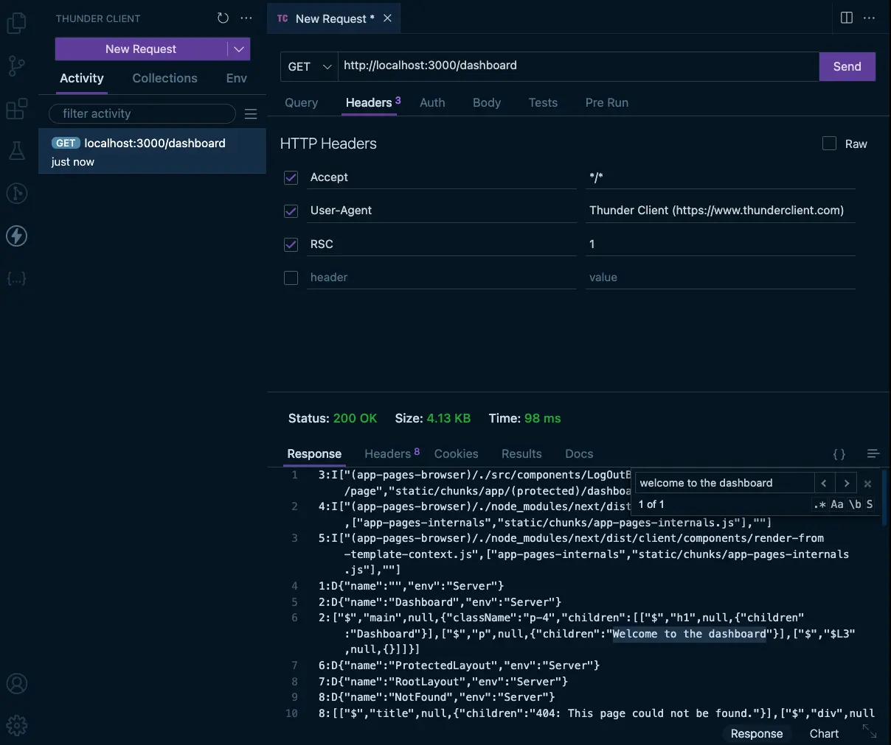

We will also add validation to the form fields using Zod and handle the form submission with a server action.

## Login Page

Let us create a new route group for the login page and the upcoming pages (register page) related to authentication. We will create a new folder named `(auth)` inside the `app` directory and add a new file named `layout.tsx` inside the `(auth)` folder. Just like we did with the `(marketing)` route group.

```tsx title="src/app/(auth)/layout.tsx"
export default function AuthLayout({ children }: React.PropsWithChildren) {
  return (
    <main className="flex h-svh flex-col items-center justify-center">
      <div className="max-w-sm rounded bg-gray-300 p-4">{children}</div>
    </main>
  );
}
```

Next, let's create a new file named `page.tsx` inside a new folder named `login` within the `(auth)` route group.

```tsx title="src/app/(auth)/login/page.tsx"
export default function LoginPage() {
  return (
    <div>
      <h1>Login</h1>
    </div>
  );
}
```

### Adding the form

Now, let's add a form to the page that allows users to enter their email and password.

```tsx title="src/app/(auth)/login/page.tsx"
// [!code highlight:20]
import Link from 'next/link';

export default function LoginPage() {
  return (
    <div>
      <h1 className="mb-4 text-center text-xl">Login</h1>
      <form className="space-y-6">
        <div className="flex flex-col gap-1">
          <label htmlFor="email">Email</label>
          <input id="email" name="email" type="email" />
        </div>
        <div className="flex flex-col gap-1">
          <label htmlFor="password">Password</label>
          <input id="password" name="password" type="password" />
        </div>
        <button className="w-full bg-black px-3 py-2 text-white">Login</button>
      </form>
    </div>
  );
}
```

Let us also add a link to the register page just below the login button. We will build the actual register page later in this course.

```tsx title="src/app/(auth)/login/page.tsx"
import Link from 'next/link';

export default function LoginPage() {
  return (
    <>
      <h1 className="mb-4 text-center text-xl">Login</h1>
      <form className="space-y-6">
        <div className="flex flex-col gap-1">
          <label htmlFor="email">Email</label>
          <input id="email" name="email" type="email" />
        </div>
        <div className="flex flex-col gap-1">
          <label htmlFor="password">Password</label>
          <input id="password" name="password" type="password" />
        </div>
        <button className="w-full bg-black px-3 py-2 text-white">Login</button>
        // [!code ++:6]
        <p>
          Don't have an account?{' '}
          <Link className="underline hover:opacity-60" href="/register">
            Register for one!
          </Link>
        </p>
      </form>
    </>
  );
}
```

#### Tip: ESLint react/no-unescaped-entities issue

This is quite an irritating issue that you might face when using the `react/no-unescaped-entities` rule in ESLint. The rule is enabled by default in the Next.js ESLint configuration. The rule throws an error when you use special characters like `&`, `<`, `>`, etc., directly in JSX. To fix this issue, you can use the `&amp;`, `&lt;`, `&gt;`, etc., HTML entities instead of the special characters. Or use template literals to render the special characters.

Some folks find this rule annoying and disable it in their ESLint configuration. But it's a good practice to use the HTML entities or template literals to avoid any issues with the special characters in JSX.

```tsx title="src/app/(auth)/login/page.tsx"
import Link from 'next/link';

export default function LoginPage() {
  return (
    <>
      <h1 className="mb-4 text-center text-xl">Login</h1>
      <form className="space-y-6">
        <div className="flex flex-col gap-1">
          <label htmlFor="email">Email</label>
          <input id="email" name="email" type="email" />
        </div>
        <div className="flex flex-col gap-1">
          <label htmlFor="password">Password</label>
          <input id="password" name="password" type="password" />
        </div>
        <button className="w-full bg-black px-3 py-2 text-white">Login</button>
        <p>
          // [!code highlight]
          {`Don't have an account? `}
          <Link className="underline hover:opacity-60" href="/register">
            Register for one!
          </Link>
        </p>
      </form>
    </>
  );
}
```

### Login Server Action

We will be using a [server action](https://nextjs.org/docs/app/building-your-application/data-fetching/server-actions-and-mutations) to handle the form submission. Let us create a new private folder named `_actions` inside the `login` route folder and add a new file named `login.ts` to store the server action.

```ts title="src/app/(auth)/login/_actions/login.ts"
'use server';

export async function login() {}
```

The [`use server`](https://react.dev/reference/rsc/use-server) directive at the top of the file tells that all the functions in this file run on the server only.

Let us now write the base implementation of the `login` function. We will log the form data to the console for now.

```ts title="src/app/(auth)/login/_actions/login.ts"
'use server';

// [!code highlight:3]
export async function login(formData: FormData) {
  console.log('login', formData);
}
```

We will attach this server action to the form submission event in the login page component. This is why we accept the `formData` object as an argument in the `login` function.

### Handling Form Submission

Let us now attach the server action to the form submission event in the login page component.

```tsx title="src/app/(auth)/login/page.tsx"
import Link from 'next/link';
import { login } from './_actions/login'; // [!code ++]

export default function LoginPage() {
  return (
    <>
      <h1 className="mb-4 text-center text-xl">Login</h1>
      // [!code highlight]
      <form action={login} className="space-y-6">
        <div className="flex flex-col gap-1">
          <label htmlFor="email">Email</label>
          <input id="email" name="email" type="email" />
        </div>
        <div className="flex flex-col gap-1">
          <label htmlFor="password">Password</label>
          <input id="password" name="password" type="password" />
        </div>
        <button className="w-full bg-black px-3 py-2 text-white">Login</button>
        <p>
          {`Don't have an account? `}
          <Link className="underline hover:opacity-60" href="/register">
            Register for one!
          </Link>
        </p>
      </form>
    </>
  );
}
```

Now, when you submit the form, the `login` function will be called with the form data. You can check the form data in the console. Check the console of the dev server to see the form data logged when you submit the form. The browser console will not show the log as the form submission is handled on the server.

### Adding Validation

We should add validation to the form fields to ensure that the user submits the correct data. We will use [Zod](https://zod.dev/) to validate the data on the server. But we will also add some client-side validation to provide instant feedback to the user.

#### Client-side Validation

This is going to be a simple validation where we check if the email and password fields are not empty when the user submits the form. We will use the browser's built-in form validation for this. Just add the `required` attribute to the email and password input fields.

```tsx title="src/app/(auth)/login/page.tsx"
import Link from 'next/link';
import { login } from './_actions/login';

export default function LoginPage() {
  return (
    <>
      <h1 className="mb-4 text-center text-xl">Login</h1>
      <form action={login} className="space-y-6">
        <div className="flex flex-col gap-1">
          <label htmlFor="email">Email</label>
          // [!code highlight]
          <input id="email" name="email" type="email" required />
        </div>
        <div className="flex flex-col gap-1">
          <label htmlFor="password">Password</label>
          // [!code highlight]
          <input id="password" name="password" type="password" required />
        </div>
        <button className="w-full bg-black px-3 py-2 text-white">Login</button>
        <p>
          {`Don't have an account? `}
          <Link className="underline hover:opacity-60" href="/register">
            Register for one!
          </Link>
        </p>
      </form>
    </>
  );
}
```

Now, if you try to submit the form without entering any data, the browser will show a validation error.

#### Server-side Validation

We will use Zod to validate the form data on the server. Let us install Zod as a dependency.

```sh
npm install zod
```

Next, let us add the Zod schema to validate the form data. We will store the schema in the same file as the server action.

```ts title="src/app/(auth)/login/_actions/login.ts"
'use server';

import { z } from 'zod'; // [!code ++]

// [!code ++:4]
const schema = z.object({
  email: z.string().email('Invalid email address'),
  password: z.string().min(6, 'Password must be at least 6 characters'), // Do not do this if you want security by abstraction, let it just be string.
});

export async function login(formData: FormData) {
  // [!code ++:11]
  const data = schema.safeParse({
    email: formData.get('email'),
    password: formData.get('password'),
  });

  // Return early if the form data is invalid
  if (!data.success) {
    return {
      errors: data.error.flatten().fieldErrors,
    };
  }
}
```

We have defined a schema that expects an object with `email` and `password` fields. The `email` field should be a valid email address, and the `password` field should be at least 6 characters long. The `safeParse` method returns an object with a `success` property that indicates if the data is valid or not. If the data is invalid, the `error` property contains the error details. We then parse the form data using the schema and return the errors early if the data is invalid.

<Callout type="error">
  Usually when dealing with login pages, you do not want to show the validation
  errors to the user. This is an implementation of security by abstraction.
</Callout>

### useFormState (useActionState) Hook

<Callout type="warn">
  Next.js and React complaints: The `useFormState` hook is part of the
  `react-dom` package. This hook is already renamed to `useActionState` and
  moved to `react` package in the canary version of React. The Next.js docs will
  suggest `useActionState`, despite it not being available yet. We will update
  the course content once the new version of React is stable and the
  `useActionState` hook is available.
</Callout>

How do we show the validation errors to the user? We can use the [`useFormState`](https://nextjs.org/docs/app/building-your-application/data-fetching/server-actions-and-mutations#server-side-validation-and-error-handling) hook provided by `react-dom` to handle the server action state. The hook takes a function and an initial state as arguments and returns the state of the server action. We can use this state to show the validation errors to the user. The below implementation shows how to use the `useFormState` hook to handle the server action state.

```tsx title="src/app/(auth)/login/page.tsx"
'use client'; // [!code ++]

import { useFormState } from 'react-dom'; // [!code ++]
import Link from 'next/link';
import { login } from './_actions/login';

export default function LoginPage() {
  const [state, formAction] = useFormState(login, null); // [!code ++]

  return (
    <>
      <h1 className="mb-4 text-center text-xl">Login</h1>
      // [!code highlight]
      <form action={formAction} className="space-y-6">
        <div className="flex flex-col gap-1">
          <label htmlFor="email">Email</label>
          <input id="email" name="email" type="email" required />
          // [!code ++]
          <p aria-live="polite">{state?.errors.email}</p>
        </div>
        <div className="flex flex-col gap-1">
          <label htmlFor="password">Password</label>
          <input id="password" name="password" type="password" required />
          // [!code ++]
          <p aria-live="polite">{state?.errors.password}</p>
        </div>
        <button className="w-full bg-black px-3 py-2 text-white">Login</button>
        <p>
          {`Don't have an account? `}
          <Link className="underline hover:opacity-60" href="/register">
            Register for one!
          </Link>
        </p>
      </form>
    </>
  );
}
```

Since we are using the `useFormState` hook, we need to add the `use client` directive at the top of the file. The hook returns an object with the server action state and a function to call the server action. We can use the state object to show the validation errors to the user. If the `errors` object in the state is not empty, we show the error message below the respective input field.

#### Tip: Aria Live

We have used the `aria-live` attribute to make the error messages accessible to screen readers. The `aria-live` attribute tells the screen reader to announce the changes to the element when the content changes. The value `polite` tells the screen reader to announce the changes when the user is idle a.k.a when the user submits the form and waits for the response.

We are not done yet, we also have to update our server action to match the new function signature.

```ts title="src/app/(auth)/login/_actions/login.ts"
'use server';

import { z } from 'zod';

const schema = z.object({
  email: z.string().email('Invalid email address'),
  password: z.string().min(6, 'Password must be at least 6 characters'),
});

// [!code highlight]
export async function login(currentState: any, formData: FormData) {
  const data = schema.safeParse({
    email: formData.get('email'),
    password: formData.get('password'),
  });

  // Return early if the form data is invalid
  if (!data.success) {
    return {
      errors: data.error.flatten().fieldErrors,
    };
  }
}
```

We do not have to worry about the `currentState` argument in this case, so we can ignore it. Now, submit the form with a valid email and a password that is less than 6 characters long. You should see the validation error below the password input field.

Typing a wrong email format will invoke the browser's built-in validation error. So, why did we have to add the email validation in the Zod schema? It has nothing to do with Zod but rather with the server-side validation. It is possible to hit the server without the browser's validation, so we need to validate the email on the server as well and not trust client-side validation alone.

### Supabase Login

To authenticate the user, we have to send the email and password to the Supabase auth service. Let us add the Supabase client to the server action and use it to authenticate the user.

```ts title="src/app/(auth)/login/_actions/login.ts"
'use server';

import { createClient } from '@/utils/supabase/server'; // [!code ++]
import { z } from 'zod';

const schema = z.object({
  email: z.string().email('Invalid email address'),
  password: z.string().min(6, 'Password must be at least 6 characters'),
});

export async function login(currentState: any, formData: FormData) {
  const data = schema.safeParse({
    email: formData.get('email'),
    password: formData.get('password'),
  });

  // Return early if the form data is invalid
  if (!data.success) {
    return {
      errors: data.error.flatten().fieldErrors,
    };
  }

  // [!code ++:12]
  const supabase = createClient();

  const { error } = await supabase.auth.signInWithPassword({
    email: data.data.email,
    password: data.data.password,
  });

  if (error) {
    return {
      errors: { email: error.message, password: error.message },
    };
  }
}
```

We have used the `createClient` function from the `@/utils/supabase/server` module to create a new Supabase client. We then use the client to authenticate the user with the email and password. If there is an error, we return the error message to the client (in this case we repeat the error for username and password). Make sure you import the client from `@/utils/supabase/server`. Only this client can be used on the server.

Try to login and you'll see an `invalid credentials` error show up. We do not have an existing user so this will fail, let us create a user. We do not have to build a register page for this. We can use the Supabase dashboard to create a new user. Our local Supabase dashboard (studio) is available at [http://localhost:54323](http://localhost:54323) (you can always get this information by running `npx supabase status`). You can create a new user from the `Users` tab in the dashboard.



Let us create a user with the email `test@test.com` and password `test@123`. Then try to login with these credentials. There won't be any validation errors but nothing else will happen either. We need to redirect the user to a new page after a successful login. Let us redirect the user to a new page named `dashboard` after a successful login.

### Redirecting the User to the Dashboard

Let us redirect the user to the dashboard page after a successful login. We can use the `redirect` function provided by `next/navigation` to redirect the user to a new page.

```ts title="src/app/(auth)/login/_actions/login.ts"
'use server';

import { createClient } from '@/utils/supabase/server';
import { redirect } from 'next/navigation'; // [!code ++]
import { z } from 'zod';

const schema = z.object({
  email: z.string().email('Invalid email address'),
  password: z.string().min(6, 'Password must be at least 6 characters'),
});

export async function login(currentState: any, formData: FormData) {
  const data = schema.safeParse({
    email: formData.get('email'),
    password: formData.get('password'),
  });

  // Return early if the form data is invalid
  if (!data.success) {
    return {
      errors: data.error.flatten().fieldErrors,
    };
  }

  const supabase = createClient();

  const { error } = await supabase.auth.signInWithPassword({
    email: data.data.email,
    password: data.data.password,
  });

  if (error) {
    return {
      errors: { email: error.message, password: error.message },
    };
  }

  redirect('/dashboard'); // [!code ++]
}
```

Try to login again with the user you created earlier. You should be redirected to the dashboard page after a successful login. We do not have a dashboard page yet, so you will see a 404 error.

### Building the Dashboard Page

Let us create a new route group called `(protected)` to store all the pages that require authentication. We will create a new file named `layout.tsx` inside the `(protected)` folder to create a layout for the protected pages. We will also add a new file named `page.tsx` inside a new folder called `dashboard` inside this route group to create the dashboard page.

```tsx title="src/app/(protected)/layout.tsx"
export default function ProtectedLayout({ children }: React.PropsWithChildren) {
  return <>{children}</>;
}
```

The dashboard page.

```tsx title="src/app/(protected)/dashboard/page.tsx"
export default function Dashboard() {
  return (
    <main className="p-4">
      <h1>Dashboard</h1>
      <p>Welcome to the dashboard</p>
    </main>
  );
}
```

### Protecting the Route Group

<Callout type="warn">Do not skip this section and read till the end!</Callout>

But how to protect the route group? We will have to check if the user is authenticated before rendering the protected pages otherwise redirect them back to the login page. We can use the `getUser` function provided by Supabase Auth to check if the user is authenticated.

We can put this logic in our `(protected)` layout file.

```tsx title="src/app/(protected)/layout.tsx"
import { createClient } from '@/utils/supabase/server';
import { redirect } from 'next/navigation';

export default async function ProtectedLayout({
  children,
}: React.PropsWithChildren) {
  const supabase = createClient();

  const {
    data: { user },
    error,
  } = await supabase.auth.getUser();

  if (error || !user) {
    redirect('/login');
  }

  return <>{children}</>;
}
```

We have used the `createClient` function to create a new Supabase client. We then use the client to get the user data. If there is an error or the user is not authenticated, we redirect the user to the login page. Otherwise, we render the children.

Let us test this by trying to access the dashboard page. You should be redirected to the login page if you are not authenticated. But we do not have a way to log out yet. Let us add a logout button to the dashboard page.

But how secure is this in reality? Let us make a GET request to the page with a special header called `RSC` set to `1` and make a request to the endpoint `http://localhost:3000/dashboard` and check the response for the text `Welcome to the dashboard`. If this was secure, we would not be able to see that text.

We use [`Thunder Client`](https://www.thunderclient.com/) to make this request. You could also use [`Postman`](https://www.postman.com/), we are using `Thunder Client` because it comes as an extension for VS Code and is pretty simple to use.



Whoa, that is not good. Or how bad is it?

It depends on the type of application you are building but yes, this is not secure. Imagine, if this course platform protected routes in a similar way. You could have easily accessed the content without paying for it!

But most dashboards are protected by something more than this. Usually, at a database level, so if the user is not authenticated, they would just see a lot of empty stuff if they tried to access it with the above method. For this course, this is perfectly fine.

<Callout type='info'>

Though we would love to explore more on this topic, we are planning a dedicated course to talk about Next.js and Security. But for now, the below resources might be helpful:

- [The Right Way to do Auth with the Next.js App Router - UPDATED](https://www.youtube.com/watch?v=v6UvgfSIjQ0)
- [Secure statically rendered paid content in Next.js (with the App Router)](https://www.ericburel.tech/blog/static-paid-content-app-router)

</Callout>

### Logging Out

We can use the `signOut` function provided by Supabase Auth to log out the user. Let us add a logout button to the dashboard page that logs out the user when clicked.

Since we want to maximize the performance of our application, we can create a smaller client component that renders the logout button. We will create a folder named `components` inside the `src` folder and add a new file named `LogOutButton.tsx` to store this component.

```tsx title="src/components/LogOutButton.tsx"
// [!code ++:23]
'use client';

import { createClient } from '@/utils/supabase/client';
import { useRouter } from 'next/navigation';

export default function LogOutButton() {
  const router = useRouter();
  const supabase = createClient();

  const handleLogOut = async () => {
    await supabase.auth.signOut();
    router.replace('/login');
  };

  return (
    <button
      onClick={handleLogOut}
      className="rounded bg-red-500 p-2 text-white"
    >
      Log Out
    </button>
  );
}
```

We have used the `createClient` function from the `@/utils/supabase/client` module to create a new Supabase client. We then use the client to log out the user when the button is clicked. We also use the `useRouter` hook to get the router object and replace the current route with the login page after logging out. Make sure to use the `use client` directive at the top of the file and that you import the `createClient` function from the correct path `@/utils/supabase/client`.

Now, let us add the logout button to the dashboard page.

```tsx title="src/app/(protected)/dashboard/page.tsx"
import LogOutButton from '@/components/LogOutButton'; // [!code ++]

export default function Dashboard() {
  return (
    <main className="p-4">
      <h1>Dashboard</h1>
      <p>Welcome to the dashboard</p>
      // [!code ++]
      <LogOutButton />
    </main>
  );
}
```

Try to log in and access the dashboard page. You should see the logout button. Clicking the button should log you out and redirect you to the login page. You also won't be able to access the dashboard page if you are not authenticated.

---

That is it for this chapter, we are ready to now test this whole flow in the next section.

At this point, our code should match the code in the branch [`3-building-login-page`](https://github.com/Frontend-Hire/login-register-flow-e2e-supabase/tree/3-building-login-page).
