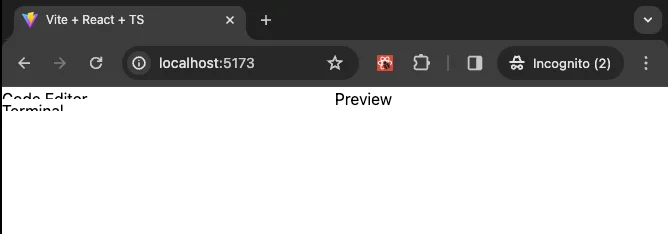
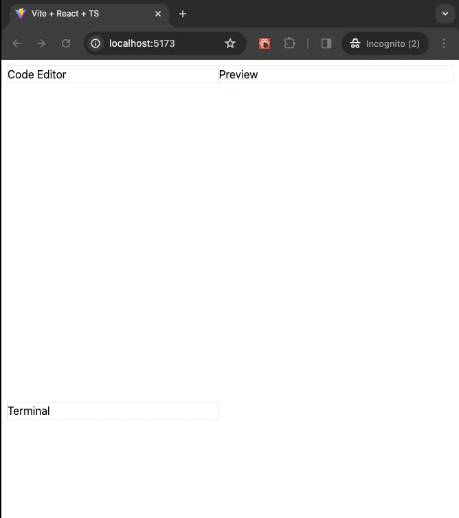
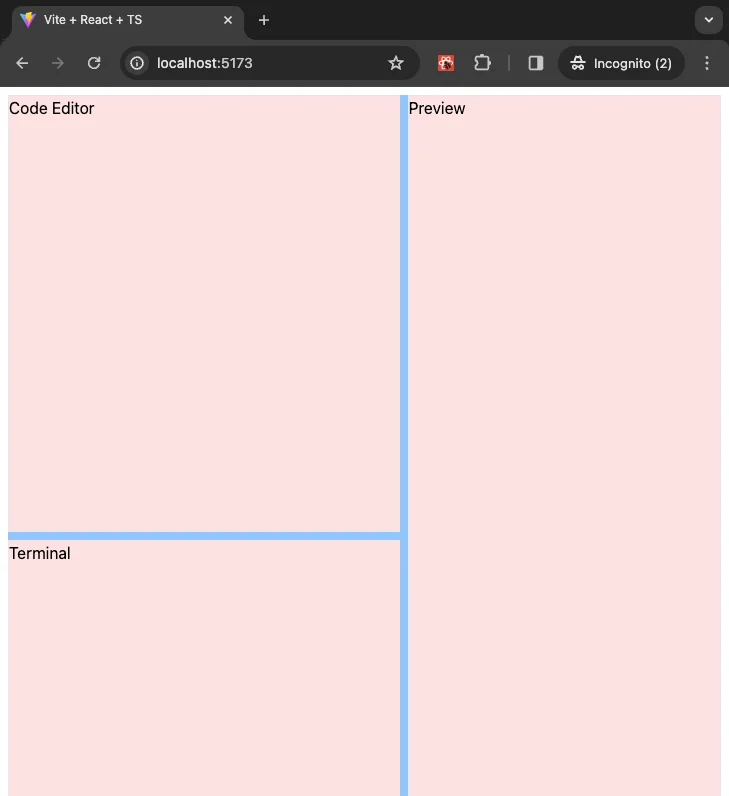

<VideoEmbed
  id="uA63G1pRchE"
  title="Stackpack | WebContainers API, Monaco Editor, XTerm | Sandpack Clone with React and TypeScript"
  startAt={688}
/>

![An illustration of a software development environment interface divided into three sections. On the left, a large panel labeled "Code Editor" is designed for writing and editing code. Below it, a smaller panel is marked "Terminal," typically used for command line operations. To the right, there's another large panel labeled "Browser Output," where the results of the code executed in the editor can be viewed. The layout suggests an integrated development environment (IDE) with real-time code execution and output display. Two small, indistinct icons within the interface suggest a resizable panel handle. The background is dark, with white text for labels, giving it a sleek, modern look.](./assets/what-are-we-building.webp)

## Our Layout

The layout of our application is divided into three sections: the code editor, the terminal, and the browser output. The panels are resizable, which means you can adjust the size of each panel to suit your needs. We can make the code editor larger if we need more space to write code or make the browser output larger to see more of the output.

We could build out the logic of the resizable panels, but it is a pain, and we might ignore too many edge cases and performance issues. Ideally, reaching out to a robust library is a better option, and we save a lot of time.

[React Resizeable Panels](https://react-resizable-panels.vercel.app/) is the react library that will help us build the layout without much effort.

Let us install it now:

```sh
pnpm add react-resizable-panels
```

Update our `src/App.tsx` file to structure our layout quickly.

```tsx title="src/App.tsx"
// [!code highlight:23]
import { Panel, PanelGroup, PanelResizeHandle } from 'react-resizable-panels';

export default function App() {
  return (
    <PanelGroup direction="horizontal">
      <Panel>
        <PanelGroup direction="vertical">
          <Panel>
            <div>Code Editor</div>
          </Panel>
          <PanelResizeHandle />
          <Panel>
            <div>Terminal</div>
          </Panel>
        </PanelGroup>
      </Panel>
      <PanelResizeHandle />
      <Panel>
        <div>Preview</div>
      </Panel>
    </PanelGroup>
  );
}
```

Our output looks quite weird at the moment.



Let us fix it.

```tsx title="src/App.tsx"
import { Panel, PanelGroup, PanelResizeHandle } from 'react-resizable-panels';

export default function App() {
  return (
    // [!code highlight]
    <div className="h-dvh p-2">
      <PanelGroup direction="horizontal">
        <Panel>
          <PanelGroup direction="vertical">
            <Panel>
              // [!code highlight]
              <div className="border">Code Editor</div>
            </Panel>
            <PanelResizeHandle />
            <Panel>
              // [!code highlight]
              <div className="border">Terminal</div>
            </Panel>
          </PanelGroup>
        </Panel>
        <PanelResizeHandle />
        <Panel>
          // [!code highlight]
          <div className="border">Preview</div>
        </Panel>
      </PanelGroup>
      // [!code highlight]
    </div>
  );
}
```

We wrapped the top-level panel group inside a `div` and gave the `div` a full height and a bit of padding on all sides. At the same time, we are adding `border` to our code editor, terminal, and preview divisions for better visual understanding.

Our app should look better now now.



Our resize works, but the handles are not visually evident. Let us fix that.

```tsx title="src/App.tsx"
import { Panel, PanelGroup, PanelResizeHandle } from 'react-resizable-panels';

export default function App() {
  return (
    <div className="h-dvh p-2">
      <PanelGroup direction="horizontal">
        <Panel>
          <PanelGroup direction="vertical">
            <Panel>
              <div className="border">Code Editor</div>
            </Panel>
            // [!code highlight]
            <PanelResizeHandle className="h-2 bg-blue-300" />
            <Panel>
              <div className="border">Terminal</div>
            </Panel>
          </PanelGroup>
        </Panel>
        // [!code highlight]
        <PanelResizeHandle className="w-2 bg-blue-300" />
        <Panel>
          <div className="border">Preview</div>
        </Panel>
      </PanelGroup>
    </div>
  );
}
```

We added a bit of height to our first resize handler since it is horizontal and a bit of width to our other resize handler since it is vertical. Both take a background color of `blue-300`.

Next, we want to ensure the code editor, preview, and terminal divs occupy all the space inside the panels. We will add a bit of red background color to help us visually see the differences.

```tsx title="src/App.tsx"
import { Panel, PanelGroup, PanelResizeHandle } from 'react-resizable-panels';

export default function App() {
  return (
    <div className="h-dvh p-2">
      <PanelGroup direction="horizontal">
        <Panel>
          <PanelGroup direction="vertical">
            <Panel>
              // [!code highlight]
              <div className="h-full border bg-red-100">Code Editor</div>
            </Panel>
            <PanelResizeHandle className="h-2 bg-blue-300" />
            <Panel>
              // [!code highlight]
              <div className="h-full border bg-red-100">Terminal</div>
            </Panel>
          </PanelGroup>
        </Panel>
        <PanelResizeHandle className="w-2 bg-blue-300" />
        <Panel>
          // [!code highlight]
          <div className="h-full border bg-red-100">Preview</div>
        </Panel>
      </PanelGroup>
    </div>
  );
}
```

Our layout should look like this now.



Perfect, we will remove the red background color later when we clean up things. However, we can now integrate the other core components that build our application.

In the next section, we will consider what component to make next; this is important because it will significantly affect our codebase.

At this point, our code should match the code in the branch [`2-layout`](https://github.com/yaralahruthik/stackpack/tree/2-layout).
