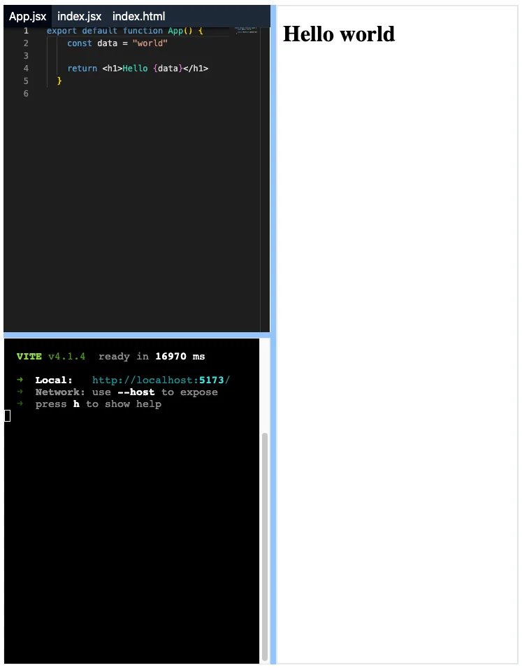

## Setting up Preview component

Create a new component called `Preview` (file `preview.tsx`) in the `components` directory.

```tsx title="src/components/preview.tsx"
// [!code ++:3]
export default function Preview() {
  return <div className="h-full border bg-red-100">Preview</div>;
}
```

We can now import the `Preview` component in the `App.tsx` file and render it.

```tsx title="src/App.tsx"
import { WebContainer } from '@webcontainer/api';
import React from 'react';
import { Panel, PanelGroup, PanelResizeHandle } from 'react-resizable-panels';
import CodeEditor from './components/code-editor';
// [!code ++]
import Preview from './components/preview';
import Terminal from './components/terminal';
import { VITE_REACT_TEMPLATE } from './templates/react-vite';

export default function App() {
  const [webContainer, setWebContainer] = React.useState<WebContainer | null>(
    null,
  );

  React.useEffect(() => {
    const createWebContainer = async () => {
      const webContainerInstance = await WebContainer.boot();
      await webContainerInstance.mount(VITE_REACT_TEMPLATE.files);
      setWebContainer(webContainerInstance);
    };

    createWebContainer();

    // Ideally, we should clean up the WebContainer instance when the component is unmounted.
    // But there is an issue with the current implementation of WebContainer that prevents it from being torn down.
    // https://github.com/stackblitz/webcontainer-core/issues/1125
    // return () => {
    //   webContainer?.teardown();
    //   setWebContainer(null);
    // };
  }, []);

  return (
    <div className="h-dvh p-2">
      <PanelGroup direction="horizontal">
        <Panel>
          <PanelGroup direction="vertical">
            <Panel>
              <CodeEditor />
            </Panel>
            <PanelResizeHandle className="h-2 bg-blue-300" />
            <Panel>
              <Terminal webContainer={webContainer} />
            </Panel>
          </PanelGroup>
        </Panel>
        <PanelResizeHandle className="w-2 bg-blue-300" />
        <Panel>
          // [!code highlight]
          <Preview />
        </Panel>
      </PanelGroup>
    </div>
  );
}
```

## Using iframe for Preview

We need a truly dynamic preview component that can render any HTML content. `iframe` elements help achieve this. Let's update the `Preview` component to use an iframe.

```tsx title="src/components/preview.tsx"
// [!code ++]
import React from 'react';

export default function Preview() {
  // [!code ++]
  const iframeRef = React.useRef<HTMLIFrameElement>(null);

  return (
    // [!code highlight:5]
    <iframe
      ref={iframeRef}
      className="h-full w-full border-2"
      src="loading.html"
    />
  );
}
```

We need to create a new file called `loading.html` at the root of our project. This file will be used to display a loading message while the preview is being loaded.

```html title="loading.html"
Use the terminal to run a command!
```

## Wiring up the Preview component with WebContainer API

We need to update the `Preview` component to listen to the `webContainer` instance and update the iframe content accordingly.

We get a `server-ready` event from the `webContainer` instance when the server is ready to serve the preview content. We can listen to this event and update the iframe content.

```tsx title="src/App.tsx"
import { WebContainer } from '@webcontainer/api';
import React from 'react';
import { Panel, PanelGroup, PanelResizeHandle } from 'react-resizable-panels';
import CodeEditor from './components/code-editor';
import Preview from './components/preview';
import Terminal from './components/terminal';
import { VITE_REACT_TEMPLATE } from './templates/react-vite';

export default function App() {
  const [webContainer, setWebContainer] = React.useState<WebContainer | null>(
    null,
  );

  React.useEffect(() => {
    const createWebContainer = async () => {
      const webContainerInstance = await WebContainer.boot();
      await webContainerInstance.mount(VITE_REACT_TEMPLATE.files);
      setWebContainer(webContainerInstance);
    };

    createWebContainer();

    // Ideally, we should clean up the WebContainer instance when the component is unmounted.
    // But there is an issue with the current implementation of WebContainer that prevents it from being torn down.
    // https://github.com/stackblitz/webcontainer-core/issues/1125
    // return () => {
    //   webContainer?.teardown();
    //   setWebContainer(null);
    // };
  }, []);

  return (
    <div className="h-dvh p-2">
      <PanelGroup direction="horizontal">
        <Panel>
          <PanelGroup direction="vertical">
            <Panel>
              <CodeEditor />
            </Panel>
            <PanelResizeHandle className="h-2 bg-blue-300" />
            <Panel>
              <Terminal webContainer={webContainer} />
            </Panel>
          </PanelGroup>
        </Panel>
        <PanelResizeHandle className="w-2 bg-blue-300" />
        <Panel>
          {/* [!code highlight] */}
          <Preview webContainer={webContainer} />
        </Panel>
      </PanelGroup>
    </div>
  );
}
```

```tsx title='src/components/preview.tsx'
// [!code ++]
import type { WebContainer } from '@webcontainer/api';
import React from 'react';

// [!code highlight:5]
export default function Preview({
  webContainer,
}: {
  webContainer: WebContainer | null;
}) {
  const iframeRef = React.useRef<HTMLIFrameElement>(null);

  // [!code ++:7]
  React.useEffect(() => {
    if (!webContainer || !iframeRef.current) return;

    webContainer.on('server-ready', (_, url) => {
      iframeRef.current!.src = url;
    });
  }, [webContainer]);

  return (
    <iframe
      ref={iframeRef}
      className="h-full w-full border-2"
      src="loading.html"
    />
  );
}
```

Now, run the dev server through the terminal we built earlier and see the preview in action.

```sh
npm install && npm run dev
```



## Updating the Preview on code changes

But, we can see that the preview is not updating when we make changes to the code. We need to update the `webContainer` to serve the updated content when the code changes.

```tsx title="src/App.tsx"
import { WebContainer } from '@webcontainer/api';
import React from 'react';
import { Panel, PanelGroup, PanelResizeHandle } from 'react-resizable-panels';
import CodeEditor from './components/code-editor';
import Preview from './components/preview';
import Terminal from './components/terminal';
import { VITE_REACT_TEMPLATE } from './templates/react-vite';

export default function App() {
  const [webContainer, setWebContainer] = React.useState<WebContainer | null>(
    null,
  );

  React.useEffect(() => {
    const createWebContainer = async () => {
      const webContainerInstance = await WebContainer.boot();
      await webContainerInstance.mount(VITE_REACT_TEMPLATE.files);
      setWebContainer(webContainerInstance);
    };

    createWebContainer();

    // Ideally, we should clean up the WebContainer instance when the component is unmounted.
    // But there is an issue with the current implementation of WebContainer that prevents it from being torn down.
    // https://github.com/stackblitz/webcontainer-core/issues/1125
    // return () => {
    //   webContainer?.teardown();
    //   setWebContainer(null);
    // };
  }, []);

  return (
    <div className="h-dvh p-2">
      <PanelGroup direction="horizontal">
        <Panel>
          <PanelGroup direction="vertical">
            <Panel>
              // [!code highlight]
              <CodeEditor webContainer={webContainer} />
            </Panel>
            <PanelResizeHandle className="h-2 bg-blue-300" />
            <Panel>
              <Terminal webContainer={webContainer} />
            </Panel>
          </PanelGroup>
        </Panel>
        <PanelResizeHandle className="w-2 bg-blue-300" />
        <Panel>
          <Preview webContainer={webContainer} />
        </Panel>
      </PanelGroup>
    </div>
  );
}
```

```tsx title="src/components/code-editor.tsx"
import { Editor } from '@monaco-editor/react';
// [!code ++]
import type { WebContainer } from '@webcontainer/api';
import React from 'react';
import { VITE_REACT_TEMPLATE } from '../templates/react-vite';
import { getLanguageFromFileName } from '../utils/get-language-from-file-name';
import FileTabs from './file-tabs';

// [!code highlight:5]
export default function CodeEditor({
  webContainer,
}: {
  webContainer: WebContainer | null;
}) {
  const [activeFile, setActiveFile] = React.useState(
    () => VITE_REACT_TEMPLATE.entry,
  );

  const currentFile = VITE_REACT_TEMPLATE.files[activeFile];
  const language = getLanguageFromFileName(activeFile);

  // [!code ++:5]
  const handleCodeChange = async (content: string) => {
    if (!webContainer) return;

    await webContainer.fs.writeFile(activeFile, content);
  };

  return (
    <div className="h-full">
      <FileTabs
        files={VITE_REACT_TEMPLATE.visibleFiles}
        activeFile={activeFile}
        onFileChange={setActiveFile}
      />
      <Editor
        theme="vs-dark"
        path={activeFile}
        // [!code ++]
        onChange={(value) => handleCodeChange(value || '')}
        defaultValue={currentFile.file.contents as string} // Ideally, worry about the encoding in production, for our example, this is fine.
        defaultLanguage={language}
      />
    </div>
  );
}
```

By writing to the WebContainer API's file system, we can update the preview content when the code changes. The Monaco editor's `onChange` event triggers the `handleCodeChange` function, which writes the updated content to the file system.

Now, you should see the preview updating as you make changes to the code.

At this point, our code should match the code in the branch [`6-building-preview`](https://github.com/Frontend-Hire/stackpack/tree/6-building-preview).
