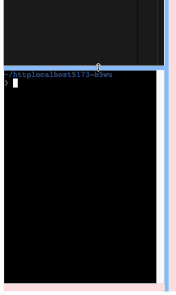

<VideoEmbed
  id="uA63G1pRchE"
  title="Stackpack | WebContainers API, Monaco Editor, XTerm | Sandpack Clone with React and TypeScript"
  startAt={2008}
/>

Like the code editor, we will not build a terminal from scratch but use a library called [`Xterm.js`](https://xtermjs.org/). This library is a terminal emulator that can be used to build a terminal in the browser.

This library is used by almost all the terminals you see on the web, and an example would be the Visual Studio Code Terminal.

## Setting up Xterm.js

To get started with Xterm.js, we need to install it using pnpm.

```sh
pnpm add @xterm/xterm
```

Next, create a new component called `Terminal` (file `terminal.tsx`) in the `components` directory.

```tsx title="src/components/terminal.tsx"
// [!code ++:3]
export default function Terminal() {
  return <div className="h-full border bg-red-100">Terminal</div>;
}
```

We can now import the `Terminal` component in the `App.tsx` file and render it.

```tsx title="src/App.tsx"
import { WebContainer } from '@webcontainer/api';
import React from 'react';
import { Panel, PanelGroup, PanelResizeHandle } from 'react-resizable-panels';
import CodeEditor from './components/code-editor';
// [!code ++]
import Terminal from './components/terminal';
import { VITE_REACT_TEMPLATE } from './templates/react-vite';

export default function App() {
  const [webContainer, setWebContainer] = React.useState<WebContainer | null>(
    null,
  );

  React.useEffect(() => {
    const createWebContainer = async () => {
      const webContainerInstance = await WebContainer.boot();
      await webContainerInstance.mount(VITE_REACT_TEMPLATE.files);
      setWebContainer(webContainerInstance);
    };

    createWebContainer();

    // Ideally, we should clean up the WebContainer instance when the component is unmounted.
    // But there is an issue with the current implementation of WebContainer that prevents it from being torn down.
    // https://github.com/stackblitz/webcontainer-core/issues/1125
    // return () => {
    //   webContainer?.teardown();
    //   setWebContainer(null);
    // };
  }, []);

  return (
    <div className="h-dvh p-2">
      <PanelGroup direction="horizontal">
        <Panel>
          <PanelGroup direction="vertical">
            <Panel>
              <CodeEditor />
            </Panel>
            <PanelResizeHandle className="h-2 bg-blue-300" />
            <Panel>
              // [!code highlight]
              <Terminal />
            </Panel>
          </PanelGroup>
        </Panel>
        <PanelResizeHandle className="w-2 bg-blue-300" />
        <Panel>
          <div className="h-full border bg-red-100">Preview</div>
        </Panel>
      </PanelGroup>
    </div>
  );
}
```

## Using Xterm.js

Since this is a third-party library just like the WebContainer, we need to do a bit of setup to get it working in React.

```tsx title="src/components/terminal.tsx"
// [!code ++:24]
import { Terminal as XTerminal } from '@xterm/xterm';
import '@xterm/xterm/css/xterm.css';
import React from 'react';

export default function Terminal() {
  const terminalRef = React.useRef<HTMLDivElement>(null);

  React.useEffect(() => {
    if (!terminalRef.current) return;

    const terminal = new XTerminal({ convertEol: true });

    terminal.open(terminalRef.current);

    return () => {
      terminal.dispose();
    };
  }, [terminalRef]);

  return (
    <div className="h-full border bg-red-100">
      <div className="h-full w-full" ref={terminalRef} />
    </div>
  );
}
```

We are importing the `Terminal` from `@xterm/xterm` as `XTerminal` to avoid conflict with our existing component name. We are also importing the CSS file for the terminal.

We are creating a `ref` for the terminal and using the `useEffect` hook to create a new terminal instance and open it in the ref element. We also dispose of the terminal when the component is unmounted.

The `convertEol` option is set to `true` to always start the cursor at the beginning of the next line ([read more about it here](https://github.com/xtermjs/xterm.js/blob/5.3.0/typings/xterm.d.ts#L56)).

We should now see a good-looking terminal in our application. But it has almost no interactivity, and we can't type anything. Let us wire it up to the WebContainer API to make it interactive.

## Wiring up the Terminal with WebContainer API

```tsx title="src/App.tsx"
import { WebContainer } from '@webcontainer/api';
import React from 'react';
import { Panel, PanelGroup, PanelResizeHandle } from 'react-resizable-panels';
import CodeEditor from './components/code-editor';
import Terminal from './components/terminal';
import { VITE_REACT_TEMPLATE } from './templates/react-vite';

export default function App() {
  const [webContainer, setWebContainer] = React.useState<WebContainer | null>(
    null,
  );

  React.useEffect(() => {
    const createWebContainer = async () => {
      const webContainerInstance = await WebContainer.boot();
      await webContainerInstance.mount(VITE_REACT_TEMPLATE.files);
      setWebContainer(webContainerInstance);
    };

    createWebContainer();

    // Ideally, we should clean up the WebContainer instance when the component is unmounted.
    // But there is an issue with the current implementation of WebContainer that prevents it from being torn down.
    // https://github.com/stackblitz/webcontainer-core/issues/1125
    // return () => {
    //   webContainer?.teardown();
    //   setWebContainer(null);
    // };
  }, []);

  return (
    <div className="h-dvh p-2">
      <PanelGroup direction="horizontal">
        <Panel>
          <PanelGroup direction="vertical">
            <Panel>
              <CodeEditor />
            </Panel>
            <PanelResizeHandle className="h-2 bg-blue-300" />
            <Panel>
              // [!code highlight]
              <Terminal webContainer={webContainer} />
            </Panel>
          </PanelGroup>
        </Panel>
        <PanelResizeHandle className="w-2 bg-blue-300" />
        <Panel>
          <div className="h-full border bg-red-100">Preview</div>
        </Panel>
      </PanelGroup>
    </div>
  );
}
```

```tsx title="src/components/terminal.tsx"
// [!code ++]
import type { WebContainer } from '@webcontainer/api';
import { Terminal as XTerminal } from '@xterm/xterm';
import '@xterm/xterm/css/xterm.css';
import React from 'react';

// [!code highlight:5]
export default function Terminal({
  webContainer,
}: {
  webContainer: WebContainer | null;
}) {
  // [!code ++]
  const [terminal, setTerminal] = React.useState<XTerminal | null>(null);
  const terminalRef = React.useRef<HTMLDivElement>(null);

  React.useEffect(() => {
    if (!terminalRef.current) return;

    const terminal = new XTerminal({ convertEol: true });

    terminal.open(terminalRef.current);
    // [!code ++]
    setTerminal(terminal);

    return () => {
      terminal.dispose();
      // [!code ++]
      setTerminal(null);
    };
  }, [terminalRef]);

  // [!code ++:28]
  React.useEffect(() => {
    if (!webContainer || !terminal) return;

    const startShell = async () => {
      const shellProcess = await webContainer.spawn('jsh', {
        terminal: {
          cols: terminal.cols,
          rows: terminal.rows,
        },
      });
      shellProcess.output.pipeTo(
        new WritableStream({
          write(data) {
            terminal.write(data);
          },
        }),
      );

      const input = shellProcess.input.getWriter();
      terminal.onData((data) => {
        input.write(data);
      });

      return shellProcess;
    };

    startShell();
  }, [webContainer, terminal]);

  return (
    <div className="h-full border bg-red-100">
      <div className="h-full w-full" ref={terminalRef} />
    </div>
  );
}
```

We save the terminal instance in the state and use it to interact with the `webContainer` instance from our parent component. We spawn a new shell process using the `jsh` shell on the `webContainer` instance and pipe the output to the terminal.

We also pass the terminal dimensions to the shell process to ensure that the shell process knows the dimensions of the terminal. We also listen for data input from the terminal and write it to the shell process.

The terminal should now be interactive, and you should be able to type commands and see the output in the terminal.

However, the terminal has an issue resizing the panel, and the commands do not wrap. Let us fix these issues now.

We need to use an addon for Xterm.js called `FitAddon` to resize the terminal when the panel is resized.

Install the `FitAddon` using pnpm.

```sh
pnpm add @xterm/addon-fit
```

Next, import the `FitAddon` to fit the terminal during initialization too so that it fits the panel and commands wrap properly.

```tsx title="src/components/terminal.tsx"
import type { WebContainer } from '@webcontainer/api';
// [!code ++]
import { FitAddon } from '@xterm/addon-fit';
import { Terminal as XTerminal } from '@xterm/xterm';
import '@xterm/xterm/css/xterm.css';
import React from 'react';

export default function Terminal({
  webContainer,
}: {
  webContainer: WebContainer | null;
}) {
  const [terminal, setTerminal] = React.useState<XTerminal | null>(null);
  const terminalRef = React.useRef<HTMLDivElement>(null);

  React.useEffect(() => {
    if (!terminalRef.current) return;

    const terminal = new XTerminal({ convertEol: true });
    // [!code ++]
    const fitAddon = new FitAddon();

    // [!code ++]
    terminal.loadAddon(fitAddon);
    terminal.open(terminalRef.current);
    setTerminal(terminal);

    // [!code ++]
    fitAddon.fit();

    return () => {
      terminal.dispose();
      setTerminal(null);
    };
  }, [terminalRef]);

  React.useEffect(() => {
    if (!webContainer || !terminal) return;

    const startShell = async () => {
      const shellProcess = await webContainer.spawn('jsh', {
        terminal: {
          cols: terminal.cols,
          rows: terminal.rows,
        },
      });
      shellProcess.output.pipeTo(
        new WritableStream({
          write(data) {
            terminal.write(data);
          },
        }),
      );

      const input = shellProcess.input.getWriter();
      terminal.onData((data) => {
        input.write(data);
      });

      return shellProcess;
    };

    startShell();
  }, [webContainer, terminal]);

  return (
    <div className="h-full border bg-red-100">
      <div className="h-full w-full" ref={terminalRef} />
    </div>
  );
}
```

Resize will still break the terminal style, but the commands should wrap adequately now. We will fix the resize issue by refitting the terminal when the panel is resized. We will have to use the [ResizeObserver API](https://developer.mozilla.org/en-US/docs/Web/API/Resize_Observer_API).

### Using ResizeObserver to Refit the Terminal on Resize

We will use the [ResizeObserver API](https://developer.mozilla.org/en-US/docs/Web/API/ResizeObserver) to observe the panel and refit the terminal when the panel is resized. We will do this without using any third-party libraries first, and then use a more robust library (a custom react hook) called [`use-resize-observer`](https://www.npmjs.com/package/use-resize-observer).

```tsx title="src/components/terminal.tsx"
import type { WebContainer } from '@webcontainer/api';
import { FitAddon } from '@xterm/addon-fit';
import { Terminal as XTerminal } from '@xterm/xterm';
import '@xterm/xterm/css/xterm.css';
import React from 'react';

export default function Terminal({
  webContainer,
}: {
  webContainer: WebContainer | null;
}) {
  const [terminal, setTerminal] = React.useState<XTerminal | null>(null);
  const terminalRef = React.useRef<HTMLDivElement>(null);

  // [!code ++:13]
  React.useEffect(() => {
    const resizeObserver = new ResizeObserver(() => {
      console.log('resized');
    });

    if (terminalRef.current) {
      resizeObserver.observe(terminalRef.current);
    }

    return () => {
      resizeObserver.disconnect();
    };
  }, []);

  React.useEffect(() => {
    if (!terminalRef.current) return;

    const terminal = new XTerminal({ convertEol: true });
    const fitAddon = new FitAddon();

    terminal.loadAddon(fitAddon);
    terminal.open(terminalRef.current);
    setTerminal(terminal);

    fitAddon.fit();

    return () => {
      terminal.dispose();
      setTerminal(null);
    };
  }, [terminalRef]);

  React.useEffect(() => {
    if (!webContainer || !terminal) return;

    const startShell = async () => {
      const shellProcess = await webContainer.spawn('jsh', {
        terminal: {
          cols: terminal.cols,
          rows: terminal.rows,
        },
      });
      shellProcess.output.pipeTo(
        new WritableStream({
          write(data) {
            terminal.write(data);
          },
        }),
      );

      const input = shellProcess.input.getWriter();
      terminal.onData((data) => {
        input.write(data);
      });

      return shellProcess;
    };

    startShell();
  }, [webContainer, terminal]);

  return (
    <div className="h-full border bg-red-100">
      <div className="h-full w-full" ref={terminalRef} />
    </div>
  );
}
```

We are observing the terminal ref using the ResizeObserver API and logging a message when the terminal is resized. Now, instead of logging a message, we will refit the terminal when the panel is resized. For this, we will use the `fitAddon.fit()` method. We will have to save the current fitAddon instance in a ref or a state to access it in the ResizeObserver callback.

We will use a ref to save the fitAddon instance and call the `fit()` method when the terminal is resized.

```tsx title="src/components/terminal.tsx"
import type { WebContainer } from '@webcontainer/api';
import { FitAddon } from '@xterm/addon-fit';
import { Terminal as XTerminal } from '@xterm/xterm';
import '@xterm/xterm/css/xterm.css';
import React from 'react';

export default function Terminal({
  webContainer,
}: {
  webContainer: WebContainer | null;
}) {
  const [terminal, setTerminal] = React.useState<XTerminal | null>(null);
  const terminalRef = React.useRef<HTMLDivElement>(null);
  // [!code ++]
  const fitAddonRef = React.useRef<FitAddon | null>(null);

  React.useEffect(() => {
    const resizeObserver = new ResizeObserver(() => {
      // [!code highlight:3]
      if (fitAddonRef.current) {
        fitAddonRef.current.fit();
      }
    });

    if (terminalRef.current) {
      resizeObserver.observe(terminalRef.current);
    }

    return () => {
      resizeObserver.disconnect();
    };
  }, []);

  React.useEffect(() => {
    if (!terminalRef.current) return;

    const terminal = new XTerminal({ convertEol: true });
    const fitAddon = new FitAddon();
    // [!code ++]
    fitAddonRef.current = fitAddon;

    terminal.loadAddon(fitAddon);
    terminal.open(terminalRef.current);
    setTerminal(terminal);

    fitAddon.fit();

    return () => {
      terminal.dispose();
      setTerminal(null);
    };
  }, [terminalRef]);

  React.useEffect(() => {
    if (!webContainer || !terminal) return;

    const startShell = async () => {
      const shellProcess = await webContainer.spawn('jsh', {
        terminal: {
          cols: terminal.cols,
          rows: terminal.rows,
        },
      });
      shellProcess.output.pipeTo(
        new WritableStream({
          write(data) {
            terminal.write(data);
          },
        }),
      );

      const input = shellProcess.input.getWriter();
      terminal.onData((data) => {
        input.write(data);
      });

      return shellProcess;
    };

    startShell();
  }, [webContainer, terminal]);

  return (
    <div className="h-full border bg-red-100">
      <div className="h-full w-full" ref={terminalRef} />
    </div>
  );
}
```

Our terminal should now resize properly when the panel is resized. The terminal should also wrap the commands properly.



There is a minor bug where the resize does leave little space at the bottom of the terminal. Honestly, we do not want to worry much about this bug as it is not a big issue and can be covered by a little CSS.

```css title="src/index.css"
@import 'tailwindcss';

/* [!code ++:3] */
.terminal {
  @apply h-full;
}
```

The terminal has a class `terminal` which we can use to apply some CSS to fix the issue. A simple fix would be to set the `height` of the terminal to `100%`.

Great, let us just replace our ResizeObserver implementation to use a more robust library. We do not have to as our implementation works fine, but a robust library handles edge cases better.

### Using `use-resize-observer` to Refit the Terminal on Resize

Install the `use-resize-observer` library using pnpm.

```sh
pnpm add use-resize-observer
```

Next, import the `use-resize-observer` hook as `useResizeObserver` and use it to observe the terminal ref and refit the terminal when the panel is resized.

```tsx title="src/components/terminal.tsx"
import type { WebContainer } from '@webcontainer/api';
import { FitAddon } from '@xterm/addon-fit';
import { Terminal as XTerminal } from '@xterm/xterm';
import '@xterm/xterm/css/xterm.css';
import React from 'react';
// [!code ++]
import useResizeObserver from 'use-resize-observer';

export default function Terminal({
  webContainer,
}: {
  webContainer: WebContainer | null;
}) {
  const [terminal, setTerminal] = React.useState<XTerminal | null>(null);
  const terminalRef = React.useRef<HTMLDivElement>(null);
  const fitAddonRef = React.useRef<FitAddon | null>(null);

  // [!code ++:7]
  const { ref } = useResizeObserver<HTMLDivElement>({
    onResize: () => {
      if (fitAddonRef.current) {
        fitAddonRef.current.fit();
      }
    },
  });

  React.useEffect(() => {
    if (!terminalRef.current) return;

    const terminal = new XTerminal({ convertEol: true });
    const fitAddon = new FitAddon();
    fitAddonRef.current = fitAddon;

    terminal.loadAddon(fitAddon);
    terminal.open(terminalRef.current);
    setTerminal(terminal);

    fitAddon.fit();

    return () => {
      terminal.dispose();
      setTerminal(null);
    };
  }, [terminalRef]);

  React.useEffect(() => {
    if (!webContainer || !terminal) return;

    const startShell = async () => {
      const shellProcess = await webContainer.spawn('jsh', {
        terminal: {
          cols: terminal.cols,
          rows: terminal.rows,
        },
      });
      shellProcess.output.pipeTo(
        new WritableStream({
          write(data) {
            terminal.write(data);
          },
        }),
      );

      const input = shellProcess.input.getWriter();
      terminal.onData((data) => {
        input.write(data);
      });

      return shellProcess;
    };

    startShell();
  }, [webContainer, terminal]);

  return (
    // [!code highlight]
    <div className="h-full border bg-red-100" ref={ref}>
      <div className="h-full w-full" ref={terminalRef} />
    </div>
  );
}
```

The only additional change we have to make is to use the `ref` from the `useResizeObserver` hook on the parent div of the terminal instead of the terminal ref.

Alright, in the next section, we will try to preview our dev server in the preview panel.

At this point, our code should match the code in the branch [`5-building-terminal`](https://github.com/yaralahruthik/stackpack/tree/5-building-terminal).
