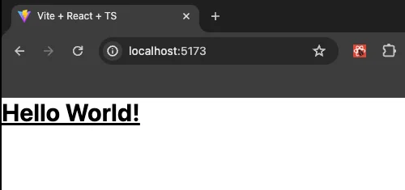

We have created a GitHub repository with the initial setup to make it easier for you. You can fork or clone the [repository](https://github.com/Frontend-Hire/stackpack) and start working on the project. The branch should be `0-start`.

```sh
git clone https://github.com/Frontend-Hire/stackpack.git
```

Then run the following commands:

```sh
cd stackpack
pnpm install
```

If you want to do this manually, check out the project setup in the course: [Todo App with React, TypeScript, and TDD](/learn/frontend/courses/todo-app-react/project-setup)

## Tailwind CSS

We will use Tailwind CSS to style our application. This course is not a Tailwind CSS course, so I will not cover the basics of Tailwind CSS. We recommend checking out the [official documentation](https://tailwindcss.com) if you are new to Tailwind CSS.

However, we will cover the setup and usage of Tailwind CSS for our project. The setup is straightforward, and we follow the [official documentation's install steps for Vite](https://tailwindcss.com/docs/installation/using-vite).

### Installing Tailwind CSS

```sh
pnpm add tailwindcss @tailwindcss/vite
```

Then configure the vite plugin:

```ts title="vite.config.ts"
// [!code ++]
import tailwindcss from '@tailwindcss/vite';
import react from '@vitejs/plugin-react-swc';
import { defineConfig } from 'vite';

// https://vite.dev/config/
export default defineConfig({
  // [!code highlight]
  plugins: [react(), tailwindcss()],
});
```

We must set up the Tailwind directives in our global CSS file, `src/index.css`

```css title='src/index.css'
@import 'tailwindcss';
```

Let us run the dev server.

```sh
pnpm dev
```

Make a slight change in the `src/App.tsx` file to see if Tailwind CSS works.

```tsx title="src/App.tsx"
export default function App() {
  // [!code highlight]
  return <div className="text-3xl font-bold underline">Hello World!</div>;
}
```

We should see the following output in the browser.



### Editor setup for Tailwind CSS

We recommend setting up a few editor extensions to make working with Tailwind CSS easier.

1. [**Tailwind CSS IntelliSense**](https://marketplace.visualstudio.com/items?itemName=bradlc.vscode-tailwindcss): This extension provides IntelliSense for Tailwind CSS in your editor. A must-have extension for working with Tailwind CSS.

2. [**Inline-fold**](https://marketplace.visualstudio.com/items?itemName=moalamri.inline-fold) (Optional): This extension allows you to fold the Tailwind CSS classes in your editor. This helps to avoid bloating the editor with a lot of classes.

### Prettier plugin to sort Tailwind CSS classes

We recommend using the [Official Prettier Plugin](https://tailwindcss.com/docs/editor-setup#automatic-class-sorting-with-prettier) to sort the Tailwind CSS classes in your editor. This plugin dramatically reduces the cognitive load of working with the classes.

Install the plugin:

```sh
pnpm add -D prettier-plugin-tailwindcss
```

Add the plugin to your `.prettierrc` file:

```json title=".prettierrc"
{
  "trailingComma": "all",
  "tabWidth": 2,
  "semi": true,
  "singleQuote": true,
  "printWidth": 80,
  "plugins": ["prettier-plugin-tailwindcss"] // [!code ++]
}
```

Great, this wraps up this section. We have a decent project setup to start working on our application.

At this point, our code should match the code in the branch [`1-project-setup`](https://github.com/Frontend-Hire/stackpack/tree/1-project-setup).
