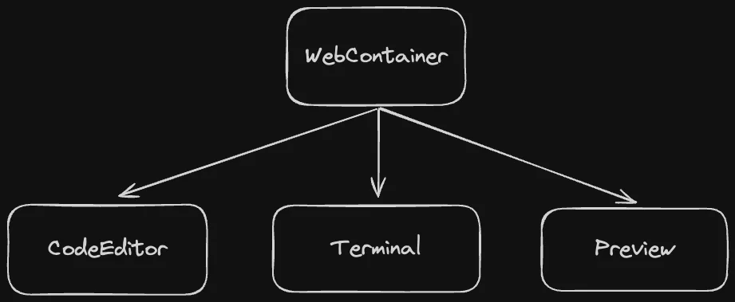

<VideoEmbed
  id="uA63G1pRchE"
  title="Stackpack | WebContainers API, Monaco Editor, XTerm | Sandpack Clone with React and TypeScript"
  startAt={915}
/>

There is no perfect answer to this. We did a POC (proof of concept) and know that working with WebContainers first makes things easier as it encompasses most of the logic and drives the other components.

It would be best if you also approached most new applications like this. A POC helps understand the structure well to avoid messing things up later. Another way is to observe how similar open-source projects are built; looking at their codebase helps understand this flow.

Since we will not cover the POC we did, we are structuring the course to optimize learning and will cover the components in this order.

1. Code Editor
2. WebContainers
3. Terminal
4. Preview

<Callout>
  It is also okay to refactor into the approach and switch up after some point.
  There is no perfect solution. The more you develop, the better you anticipate
  changes.
</Callout>
