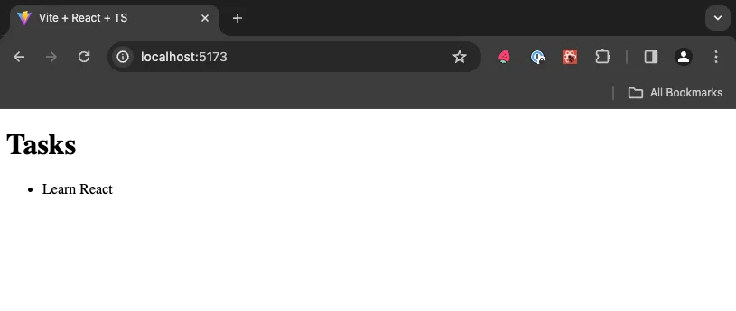

<VideoEmbed
  id="a-SVcyExHjs"
  title="Reading and Adding Tasks | Todo App with React, TypeScript, TDD | Frontend Hire"
/>

Also, run the dev server and open the respective dev URL as shown by Vite in your browser.

```sh
npm run dev
```

## Data Structure

Let's think about the data structure for our tasks. We'll need to think about the following:

- What properties does a task have?
- What types do those properties have?
- What is the shape of the data?

Let's start with the first question. What properties does a task have? We'll start with the following:

- Unique ID
- Title
- Completion Status
- Priority (optional)

Now let's think about the types for each of these properties. We'll start with the following:

- **Unique ID** can be a number or a string, but we'll use a number for now.
- **Title** is a string.
- **Completion Status** is a boolean.
- **Priority** is optional, but it can only be one of three values: `'p1'`, `'p2'`, or `'p3'`.

This gives us the following types for `Task` and `Priority`:

```tsx
type Priority = 'p1' | 'p2' | 'p3';

type Task = {
  id: number;
  title: string;
  isCompleted: boolean;
  priority?: Priority;
};
```

<Callout type="warn">
  Unique IDs are usually created by a database. In this project, we'll use the
  [current time in
  milliseconds](https://developer.mozilla.org/en-US/docs/Web/JavaScript/Reference/Global_Objects/Date/getTime)
  as the ID for each task.
</Callout>

## Render Tasks with Default Data

Now that we have our `Task` data structure type, let's create some default data to work with. We'll create an array of `tasks`, and we'll use the `Task` data structure we just created to define the types for the array.

```tsx
const tasks: Task[] = [
  {
    id: 1,
    title: 'Learn React',
    isCompleted: true,
  },
];
```

Now that we have some data, let's render it to the screen. We'll use the `map` method to iterate over the `tasks` array and render each task to the screen.

```tsx
<ul>
  {tasks.map((task) => (
    <li key={task.id}>{task.title}</li>
  ))}
</ul>
```

<Callout>
  The `key` prop is required when rendering a list of items. It helps React keep
  track of which items have changed, are added, or are removed. Read more about
  rendering lists and keys [here](https://react.dev/learn/rendering-lists).
</Callout>

Putting it all together, we should have the following `App.tsx` file:

```tsx title="App.tsx"
type Priority = 'p1' | 'p2' | 'p3';

type Task = {
  id: number;
  title: string;
  isCompleted: boolean;
  priority?: Priority;
};

function App() {
  const tasks: Task[] = [
    {
      id: 1,
      title: 'Learn React',
      isCompleted: true,
      priority: 'p1',
    },
  ];

  return (
    <div>
      <h1>Tasks</h1>
      <ul>
        {tasks.map((task) => (
          <li key={task.id}>{task.title}</li>
        ))}
      </ul>
    </div>
  );
}

export default App;
```

You should see the following in your browser:


Great! We've created some default data and rendered it to the screen. In the next section, we'll add some interactivity by creating an input and button to add new tasks.

At this point, your code should be a good match to the branch of the repository: [2-reading-tasks](https://github.com/yaralahruthik/todo-app-react-tdd-typescript/tree/2-reading-tasks)
