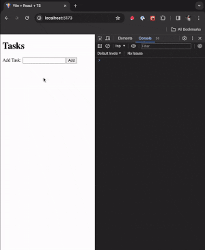
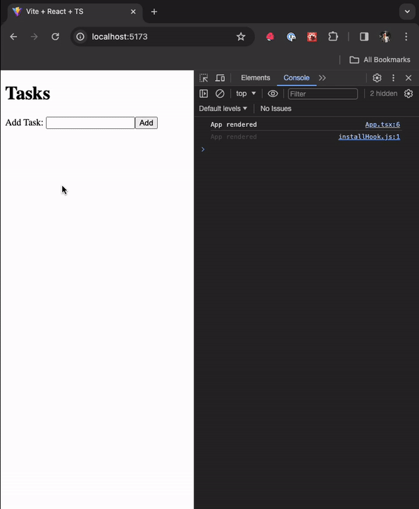
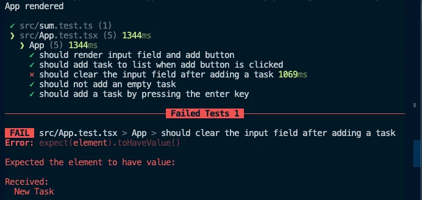

<VideoEmbed
  id="UtOxGwg-FUY"
  title="Test Driven Development | Todo App with React, TypeScript, TDD | Frontend Hire"
/>

## Why Refactor?

We want to list a few reasons why refactoring is essential:

- The first lines of code you write are usually not the best. You'll learn more about the problem you're solving as you go and find better ways to solve it.

- Refactoring is the process of improving your code by writing it in a better way.

- Refactoring is a way to improve the design of your code. It's a way to make your code more readable, maintainable, and extensible.

- We always read more code than we write. So, writing code that's easy to read and understand is important.

Now, of course, the topic of refactoring is vast. There are entire books written about it. So, we just covered the bare minimum here. In our case, we'll focus on our code to make it more readable, maintainable, and extensible and make some performance improvements.

### Let's see our current file that contains the entire code for the Todo App

```tsx title="./src/App.tsx"
import React from 'react';

type Priority = 'p1' | 'p2' | 'p3';

type Task = {
  id: number;
  title: string;
  isCompleted: boolean;
  priority?: Priority;
};

function App() {
  const [tasks, setTasks] = React.useState<Task[]>([]);

  const [taskName, setTaskName] = React.useState('');

  const onAddTask = () => {
    const trimmedTaskName = taskName.trim();

    if (!trimmedTaskName) {
      return;
    }

    setTasks([
      ...tasks,
      {
        id: new Date().getTime(), // Not a great way to generate IDs
        title: trimmedTaskName,
        isCompleted: false,
      },
    ]);

    setTaskName('');
  };

  const onInputKeyDown = (e: React.KeyboardEvent<HTMLInputElement>) => {
    if (e.key === 'Enter') {
      onAddTask();
    }
  };

  return (
    <div>
      <h1>Tasks</h1>
      <label htmlFor="task-input">Add Task: </label>
      <input
        id="task-input"
        value={taskName}
        onChange={(e) => setTaskName(e.target.value)}
        onKeyDown={onInputKeyDown}
      />
      <button onClick={onAddTask}>Add</button>
      <ul>
        {tasks.map((task) => (
          <li key={task.id}>{task.title}</li>
        ))}
      </ul>
    </div>
  );
}

export default App;
```

Honestly, this is not bad code, and it seems easy to read with around 62 lines of code. But we can still improve it. Here are a couple of things we find that can be improved:

- The `Task` type is defined inside the `App` component. This is not a good practice. We should move it outside the component.

- The input has a good amount of logic that can be extracted into a separate component.

Let's do these two things first. Of course, refactoring is a continuous process. So, we'll keep improving our code as we go.

### Moving the `Task` type outside the `App` component

Move the `Task` type outside the `App` component. We'll create a new file called `types.ts` inside the `src` folder and move the `Task` type there. We'll also move the `Priority` type there as well.

```tsx title="./src/types.ts"
// [!code ++:8]
type Priority = 'p1' | 'p2' | 'p3';

export type Task = {
  id: number;
  title: string;
  isCompleted: boolean;
  priority?: Priority;
};
```

Export the `Task` type from the `types.ts` file, and import it in the `App` component.

```tsx title="./src/App.tsx"
import React from 'react';
import { Task } from './types'; // [!code ++]

// Rest of the code omitted for brevity
```

Our main file is already 10 lines shorter. Let's move on to the next step.

### Extracting the input into a separate component

Create a new `TaskInput.tsx` file inside the `src` folder. We'll move the input and the respective label into this file.

```tsx title="./src/TaskInput.tsx"
// [!code ++:13]
export default function TaskInput() {
  return (
    <>
      <label htmlFor="task-input">Add Task: </label>
      <input
        id="task-input"
        value={taskName}
        onChange={(e) => setTaskName(e.target.value)}
        onKeyDown={onInputKeyDown}
      />
    </>
  );
}
```

Of course, this won't work because we're using `taskName`, `setTaskName`, and `onInputKeyDown` inside the `Input` component. We'll pass these as props to the `TaskInput` component.

```tsx title="./src/TaskInput.tsx"
// [!code ++:5]
type TaskInputProps = {
  taskName: string;
  setTaskName: (taskName: string) => void;
  onInputKeyDown: (e: React.KeyboardEvent<HTMLInputElement>) => void;
};

// [!code ++:5]
export default function TaskInput({
  taskName,
  setTaskName,
  onInputKeyDown,
}: TaskInputProps) {
  return (
    <>
      <label htmlFor="task-input">Add Task: </label>
      <input
        id="task-input"
        value={taskName}
        onChange={(e) => setTaskName(e.target.value)}
        onKeyDown={onInputKeyDown}
      />
    </>
  );
}
```

Let's use the new `TaskInput` component in the `App`.

```tsx title="./src/App.tsx"
import React from 'react';
import { Task } from './types';
import TaskInput from './TaskInput'; // [!code ++]

function App() {
  // Some of the code omitted for brevity

  return (
    <div>
      <h1>Tasks</h1>
      // [!code ++:5]
      <TaskInput
        taskName={taskName}
        setTaskName={setTaskName}
        onInputKeyDown={onInputKeyDown}
      />
      <button onClick={onAddTask}>Add</button>
      <ul>
        {tasks.map((task) => (
          <li key={task.id}>{task.title}</li>
        ))}
      </ul>
    </div>
  );
}

// Rest of the code omitted for brevity
```

Honestly, this is not a huge improvement at all. We just abstracted the label and input it into a separate component. Also, the number of lines has barely changed.

But let's have a good look at our components. Can we move the button to our new `TaskInput` component? Let's try that.

```tsx title="./src/TaskInput.tsx"
type TaskInputProps = {
  taskName: string;
  setTaskName: (taskName: string) => void;
  onInputKeyDown: (e: React.KeyboardEvent<HTMLInputElement>) => void;
  onAddTask: () => void; // [!code ++]
};

export default function TaskInput({
  taskName,
  setTaskName,
  onInputKeyDown,
  onAddTask, // [!code ++]
}: TaskInputProps) {
  return (
    <>
      <label htmlFor="task-input">Add Task: </label>
      <input
        id="task-input"
        value={taskName}
        onChange={(e) => setTaskName(e.target.value)}
        onKeyDown={onInputKeyDown}
      />
      // [!code ++]
      <button onClick={onAddTask}>Add</button>
    </>
  );
}
```

We'll also pass the `onAddTask` function to the `TaskInput` component.

```tsx title="./src/App.tsx"
// Rest of the code omitted for brevity

function App() {
  // Some of the code omitted for brevity

  return (
    <div>
      <h1>Tasks</h1>
      <TaskInput
        taskName={taskName}
        setTaskName={setTaskName}
        onInputKeyDown={onInputKeyDown}
        onAddTask={onAddTask} // [!code ++]
      />
      <ul>
        {tasks.map((task) => (
          <li key={task.id}>{task.title}</li>
        ))}
      </ul>
    </div>
  );
}

// Rest of the code omitted for brevity
```

We are getting there. Let's also think of a better name for the `TaskInput` component. We'll rename it to `AddTask`. Also, we'll rename to file to `AddTask.tsx`.

```tsx title="./src/AddTask.tsx"
type AddTaskProps = {
  // [!code highlight]
  // Some of the code omitted for brevity
};

export default function AddTask({
  // [!code highlight]
  taskName,
  setTaskName,
  onInputKeyDown,
  onAddTask,
}: AddTaskProps) {
  // [!code highlight]
  // Some of the code omitted for brevity
}
```

Our `App` component must also be updated with the new name.

```tsx title="./src/App.tsx"
// Rest of the code omitted for brevity
import AddTask from './AddTask'; // [!code highlight]

function App() {
  // Some of the code omitted for brevity

  return (
    <div>
      <h1>Tasks</h1>
      // [!code highlight]
      <AddTask
        taskName={taskName}
        setTaskName={setTaskName}
        onInputKeyDown={onInputKeyDown}
        onAddTask={onAddTask}
      />
      {/* Some of the code omitted for brevity */}
    </div>
  );
}

// Rest of the code omitted for brevity
```

Now, we can also move the `onInputKeyDown` function to the `AddTask` component as it just calls the `onAddTask` function. Also, let's update the props accordingly.

```tsx title="./src/AddTask.tsx"
// [!code highlight:5]
type AddTaskProps = {
  taskName: string;
  setTaskName: (taskName: string) => void;
  onAddTask: () => void;
};

// [!code highlight:10]
export default function AddTask({
  taskName,
  setTaskName,
  onAddTask,
}: AddTaskProps) {
  const onInputKeyDown = (e: React.KeyboardEvent<HTMLInputElement>) => {
    if (e.key === 'Enter') {
      onAddTask();
    }
  };

  // Rest of the code omitted for brevity
}
```

We'll also update the `App` component accordingly.

```tsx title="./src/App.tsx"
import React from 'react';
import { Task } from './types';
import AddTask from './AddTask';

function App() {
  const [tasks, setTasks] = React.useState<Task[]>([]);

  const [taskName, setTaskName] = React.useState('');

  const onAddTask = () => {
    const trimmedTaskName = taskName.trim();

    if (!trimmedTaskName) {
      return;
    }

    setTasks([
      ...tasks,
      {
        id: new Date().getTime(), // Not a great way to generate IDs
        title: trimmedTaskName,
        isCompleted: false,
      },
    ]);

    setTaskName('');
  };

  return (
    <div>
      <h1>Tasks</h1>
      // [!code highlight:5]
      <AddTask
        taskName={taskName}
        setTaskName={setTaskName}
        onAddTask={onAddTask}
      />
      <ul>
        {tasks.map((task) => (
          <li key={task.id}>{task.title}</li>
        ))}
      </ul>
    </div>
  );
}

export default App;
```

Now we can see some reduction in the number of lines. Now, there is one more refactoring we can do that would improve our app's performance.

### Let's see the performance problem in our app

Put up a console.log inside the `App` component and see how many times it's being called when we type something in the input.

```tsx title="./src/App.tsx"
// Rest of the code omitted for brevity

function App() {
  console.log('App rendered'); // [!code ++]

  // Rest of the code omitted for brevity
}

// Rest of the code omitted for brevity
```



### Why is the `App` component being rendered so many times?

It all has to do with where our state is located. Our app has two states: `tasks` and `taskName`. The respective state is updated at different places in our app. The `tasks` state is updated inside the `onAddTask` function, and the `taskName` state is updated inside the `setTaskName` function.

```tsx title="./src/App.tsx" {6, 8, 17-24, 26, 34}
// Rest of the code omitted for brevity

function App() {
  console.log('App rendered');

  const [tasks, setTasks] = React.useState<Task[]>([]); // [!code highlight]

  const [taskName, setTaskName] = React.useState(''); // [!code highlight]

  const onAddTask = () => {
    const trimmedTaskName = taskName.trim();

    if (!trimmedTaskName) {
      return;
    }

    // [!code highlight:8]
    setTasks([
      ...tasks,
      {
        id: new Date().getTime(), // Not a great way to generate IDs
        title: trimmedTaskName,
        isCompleted: false,
      },
    ]);

    setTaskName(''); // [!code highlight]
  };

  return (
    <div>
      <h1>Tasks</h1>
      <AddTask
        taskName={taskName}
        setTaskName={setTaskName} // [!code highlight]
        onAddTask={onAddTask}
      />
      <ul>
        {tasks.map((task) => (
          <li key={task.id}>{task.title}</li>
        ))}
      </ul>
    </div>
  );
}

// Rest of the code omitted for brevity
```

We could argue that the `App` component should be rendered when the `tasks` state is updated but not when the `taskName` state is updated. And we're right. But React doesn't know that. React will re-render the `App` component whenever any state inside the `App` is updated. And that's why the `App` component is being rendered so many times.

But we know the `taskName` state is only used inside the `AddTask` component. So, we can move the `taskName` state inside the `AddTask` component. Let's do that.

```tsx title="./src/AddTask.tsx"
import React from 'react'; // [!code ++]

// [!code highlight:3]
type AddTaskProps = {
  onAddTask: (taskName: string) => void;
};

// [!code highlight]
export default function AddTask({ onAddTask }: AddTaskProps) {
  const [taskName, setTaskName] = React.useState(''); // [!code ++]

  const onInputKeyDown = (e: React.KeyboardEvent<HTMLInputElement>) => {
    if (e.key === 'Enter') {
      onAddTask(taskName); // [!code highlight]
    }
  };

  return (
    <>
      <label htmlFor="task-input">Add Task: </label>
      <input
        id="task-input"
        value={taskName}
        onChange={(e) => setTaskName(e.target.value)}
        onKeyDown={onInputKeyDown}
      />
      // [!code highlight]
      <button onClick={() => onAddTask(taskName)}>Add</button>
    </>
  );
}
```

We had to update our types as the `App` component now needs to know what task the `AddTask` component sends.

Let us also clean the `App` component.

```tsx title="./src/AddTask.tsx"
import React from 'react';
import { Task } from './types';
import AddTask from './AddTask';

function App() {
  console.log('App rendered');

  const [tasks, setTasks] = React.useState<Task[]>([]);

  const onAddTask = (taskName: string) => {
    // [!code highlight]
    const trimmedTaskName = taskName.trim();

    if (!trimmedTaskName) {
      return;
    }

    setTasks([
      ...tasks,
      {
        id: new Date().getTime(), // Not a great way to generate IDs
        title: trimmedTaskName,
        isCompleted: false,
      },
    ]);
  };

  return (
    <div>
      <h1>Tasks</h1>
      <AddTask onAddTask={onAddTask} /> // [!code highlight]
      <ul>
        {tasks.map((task) => (
          <li key={task.id}>{task.title}</li>
        ))}
      </ul>
    </div>
  );
}

export default App;
```

Try typing something in the input now. You'll see that the `App` component is not being rendered anymore unless a new task is added, which is expected.



<Callout>
  We want to mention that this is not a huge performance problem. But it's a
  good example of improving our app's performance without fancy tools like
  useCallback, useMemo, etc. Even those tools won't help us much in this case.
</Callout>

### Oops, We seem to have broken something

If you try to add a new task now, you'll see that the input is not being cleared. The `taskName` state is now inside the `AddTask` component. So, we need to clear the input inside the `AddTask` component.

Though we saw this issue visually, we could have also caught it by running our existing tests. Some of our functionality might not always caught visually. So, it's always a good idea to run our tests after refactoring (in fact, have it running while refactoring too).

Let's run our tests.

```sh
npm test
```



We can see that the `Input Clear Test` is failing. Let's fix it.

```tsx title="./src/AddTask.tsx"
import React from 'react';

type AddTaskProps = {
  onAddTask: (taskName: string) => void;
};

export default function AddTask({ onAddTask }: AddTaskProps) {
  const [taskName, setTaskName] = React.useState('');

  // [!code ++:10]
  const handleAddTask = () => {
    const trimmedTaskName = taskName.trim();

    if (!trimmedTaskName) {
      return;
    }

    onAddTask(trimmedTaskName);
    setTaskName('');
  };

  const onInputKeyDown = (e: React.KeyboardEvent<HTMLInputElement>) => {
    if (e.key === 'Enter') {
      handleAddTask(); // [!code highlight]
    }
  };

  return (
    <>
      <label htmlFor="task-input">Add Task: </label>
      <input
        id="task-input"
        value={taskName}
        onChange={(e) => setTaskName(e.target.value)}
        onKeyDown={onInputKeyDown}
      />
      // [!code highlight]
      <button onClick={handleAddTask}>Add</button>
    </>
  );
}
```

We are proxying the `onAddTask` function inside the `handleAddTask` function. This enables us to add more logic to the `handleAddTask` function, clearing the input and passing the trimmed task to the parent without affecting the `onAddTask` function. This also cleans up the `App` component.

```tsx title="./src/App.tsx"
import React from 'react';
import { Task } from './types';
import AddTask from './AddTask';

function App() {
  const [tasks, setTasks] = React.useState<Task[]>([]);

  // [!code highlight:10]
  const onAddTask = (taskName: string) => {
    setTasks([
      ...tasks,
      {
        id: new Date().getTime(), // Not a great way to generate IDs
        title: taskName,
        isCompleted: false,
      },
    ]);
  };

  return (
    <div>
      <h1>Tasks</h1>
      <AddTask onAddTask={onAddTask} />
      <ul>
        {tasks.map((task) => (
          <li key={task.id}>{task.title}</li>
        ))}
      </ul>
    </div>
  );
}

export default App;
```

Our tests are passing now, and we have a much cleaner code.

### Using the Form to contain the input and button

A few folks in one of our webinars pointed out that we could have used a form to contain the input and the button. This is a good idea. As it will help eliminate the need for the `onInputKeyDown` function. Let's do that.

Let's do that now.

```tsx title="./src/AddTask.tsx"
// Rest of the code omitted for brevity

export default function AddTask({ onAddTask }: AddTaskProps) {
  const [taskName, setTaskName] = React.useState('');

  const handleAddTask = () => {
    const trimmedTaskName = taskName.trim();

    if (!trimmedTaskName) {
      return;
    }

    onAddTask(trimmedTaskName);
    setTaskName('');
  };

  return (
    // [!code highlight]
    <form>
      <label htmlFor="task-input">Add Task: </label>
      // [!code highlight:5]
      <input
        id="task-input"
        value={taskName}
        onChange={(e) => setTaskName(e.target.value)}
      />
      <button onClick={handleAddTask}>Add</button>
      // [!code highlight]
    </form>
  );
}
```

We removed the `onInputKeyDown` function and the `onKeyDown` event listener from the input. We also wrapped the label, input, and button inside a `form` element. Our tests will still pass, but this approach has an issue. The form will be submitted when the button is clicked, and the browser will refresh. We don't want that. We want to prevent the form from submitting. We can add an `onSubmit` event listener to the form and stop the default event.

```tsx title="./src/AddTask.tsx"
// Rest of the code omitted for brevity

export default function AddTask({ onAddTask }: AddTaskProps) {
  const [taskName, setTaskName] = React.useState('');

  // [!code highlight]
  const handleAddTask = (e: React.FormEvent<HTMLFormElement>) => {
    e.preventDefault(); // [!code ++]
    const trimmedTaskName = taskName.trim();

    if (!trimmedTaskName) {
      return;
    }

    onAddTask(trimmedTaskName);
    setTaskName('');
  };

  return (
    // [!code highlight]
    <form onSubmit={handleAddTask}>
      <label htmlFor="task-input">Add Task: </label>
      <input
        required // [!code ++]
        id="task-input"
        value={taskName}
        onChange={(e) => setTaskName(e.target.value)}
      />
      // [!code highlight]
      <button>Add</button>
    </form>
  );
}
```

We added an `onSubmit` event listener to the form. We also added the `required` attribute to the input. This will prevent the form from submitting if the input is empty. We also updated the `handleAddTask` function to accept the `e` argument of type `React.FormEvent<HTMLFormElement>`. We also called the `preventDefault` method on the `e` argument to prevent the form from submitting.

We saw how good tests can help us maintain good code quality. We also saw how to improve our app's performance by moving the state to the right place.

This was a straightforward example of refactoring. But we hope you have an idea of how to refactor your code.

This is the end of this section. In the next section, we'll discuss component composition.

At this point, your code should be a good match to the branch of the repository: [7-refactoring](https://github.com/yaralahruthik/todo-app-react-tdd-typescript/tree/7-refactoring)
