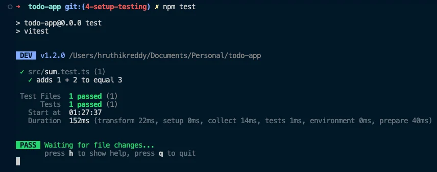

<VideoEmbed
  id="KHX9KAa8zGk"
  title="Setup Testing | Todo App with React, TypeScript, TDD | Frontend Hire"
/>

Testing is tedious. Testing is boring. Developers avoid it.

Testing is important. Testing is necessary. Developers need to do it.

Manual testing is expensive and time-consuming. Automated testing is cheap and fast.

Also, there are not a lot of testing tutorials out there, as there are tutorials on how to build a web app.

This causes many developers to avoid testing because they lack understanding of the process and the tools. I wouldn't even say I like testing as a frontend developer. But I have a system that works for me, and I want to share it with you.

But first, we need to set up our tools.

## Vitest

Since we are using Vite, we greatly benefit from a native testing solution, Vitest. You can read more about [Why Vitest here](https://vitest.dev/guide/why.html).

Most companies out there use Jest for testing. Luckily, Vitest is compatible with Jest.

Either way, we need to install Vitest first. Run the following command in your terminal:

```sh
npm install -D vitest
```

Let us test if Vitest is working. The following steps are directly taken from the docs [here](https://vitest.dev/guide/#writing-tests).

### Create a file called `sum.ts` inside the `src` folder. Paste the following code inside it:

```ts title="./src/sum.ts"
export function sum(a: number, b: number) {
  return a + b;
}
```

### Similarly, create a file called `sum.test.ts` inside the `src` folder. Paste the following code inside it:

```ts title="./src/sum.test.ts"
import { expect, test } from 'vitest';
import { sum } from './sum';

test('adds 1 + 2 to equal 3', () => {
  expect(sum(1, 2)).toBe(3);
});
```

### Update `package.json` file to include the following script:

```json title="./package.json"
{
  // Rest of the file omitted for brevity

  "scripts": {
    "dev": "vite",
    "build": "tsc && vite build",
    "test": "vitest", // [!code ++]
    "lint": "eslint . --ext ts,tsx --report-unused-disable-directives --max-warnings 0",
    "preview": "vite preview",
    "prepare": "husky install"
  }

  // Rest of the file omitted for brevity
}
```

### Run the following command in your terminal:

```sh
npm run test
```

And then, you should see something like this:


This little test we wrote is called a `unit test`. It is a test that tests a small unit of code. In this case, we are testing the `sum` function.

These kinds of tests are fundamental because they test the small units of code that make up your app.

Also, using a **TDD** (Test Driven Development) approach is more straightforward with unit tests. You can write the unit tests and then the code to pass the tests.

Okay, now that we have Vitest set up. We need one more tool to finish our setup.

## React Testing Library (RTL)

<Callout>

We would first highly recommend:

- You read the [guiding principles of the testing library](https://testing-library.com/docs/guiding-principles).
- You read the blog post on [Testing Implementation Details](https://kentcdodds.com/blog/testing-implementation-details) by Kent C. Dodds.

</Callout>

Either way, we need to install RTL to test our React components. Run the following command in your terminal:

```sh
npm install -D @testing-library/react
```

Also, since we use Vitest and not Jest ([read more here](https://testing-library.com/docs/react-testing-library/setup#using-without-jest)), we have to install a test environment called `jsdom`. Run the following command in your terminal:

```sh
npm install -D jsdom
```

## Configuring Vitest and React Testing Library

Now that we have all the tools installed, we must configure them. This is pretty simple; it is usually only done once and never touched again.

But to figure out the actual configuration can be painful. I'd suggest going through the docs at a time when you are not tired and can focus on the task at hand.

The best part about configuring Vitest is using our existing `vite.config.ts` file. We need to add a few lines of code to it.

```ts title="./vite.config.ts" {1, 8-10}
// [!code ++]
/// <reference types="vitest" />
import { defineConfig } from 'vite';
import react from '@vitejs/plugin-react';

// https://vitejs.dev/config/
export default defineConfig({
  plugins: [react()],
  // [!code ++:3]
  test: {
    environment: 'jsdom',
  },
});
```

We got this configuration from the docs [here](https://vitest.dev/config/#configuring-vitest). More configuration and packages might be required, but we will figure that out as needed.

Great, we can now start writing our first actual tests.

At this point, your code should be a good match to the branch of the repository: [4-setup-testing](https://github.com/yaralahruthik/todo-app-react-tdd-typescript/tree/4-setup-testing)
