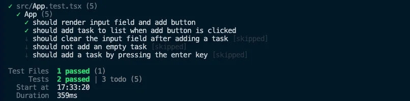

<VideoEmbed
  id="UtOxGwg-FUY"
  title="Test Driven Development | Todo App with React, TypeScript, TDD | Frontend Hire"
/>

Let's run our dev server and see the current state of our Todo app.

```sh
npm run dev
```

Open the respective dev server url in the browser.

Now, we can immediately see a couple of things that we need to fix:

1. When we type into the input field and click the add button, the task gets added, but the input field is not cleared.
2. Click on the add button with an empty input field, and you can add an empty task, which should not happen.
3. A good to-have feature would be to add a task by pressing the enter key.

Let's fix these issues one by one while following a Test Driven Development approach.

## What is TDD?

You could Google it and find a lot of definitions. Here is a simple one:

> TDD is a software development process in which you write tests before you write the actual code.

## Why TDD?

- It helps you to think about the problem you are trying to solve before you write the code.
- It helps you to write more confident code.
- It helps you to write more testable code.
- It helps improve accessibility.
- It helps in refactoring.

Now, let's get started with TDD.

## Let's fix the issues

### Declare the tests first

A good name for the tests would be:

1. `should clear the input field after adding a task`.
2. `should not add an empty task`.
3. `should add a task by pressing the enter key`.

```tsx title="./src/App.test.tsx"
// Rest of the code is omitted for brevity

describe('App', () => {
  // Some of the tests are omitted for brevity

  test.todo('should clear the input field after adding a task', () => {}); // [!code ++]

  test.todo('should not add an empty task', () => {}); // [!code ++]

  test.todo('should add a task by pressing the enter key', () => {}); // [!code ++]
});
```

What's a `test.todo` you ask? It's a test that is yet to be implemented. Writing all the tests and implementing them individually is a good practice. (Read more about it [here](https://vitest.dev/api/#test-todo)).

If you run the tests now, you will see an output like the one below:



The todo tests are marked as skipped. Let's implement them one by one.

### Test: should clear the input field after adding a task

Let's implement the first test. We need to do the following:

1. Type into the input field.
2. Click on the add button.
3. Assert that the input field is cleared.

```tsx title="./src/App.test.tsx"
// Rest of the code is omitted for brevit

describe('App', () => {
  // Some of the tests are omitted for brevity

  // [!code highlight:14]
  test('should clear the input field after adding a task', async () => {
    const user = userEvent.setup();
    render(<App />);

    const input = screen.getByRole('textbox', { name: 'Add Task:' });
    const button = screen.getByRole('button', { name: 'Add' });

    await user.type(input, 'New Task');
    await user.click(button);

    await waitFor(() => {
      expect(input).toHaveValue('');
    });
  });

  // Some of the tests are omitted for brevity
});
```

Make sure to remove the `test.todo` and replace it with `test` before running the tests and you should see a failing test.


Let's now write the code to make the test pass.

```tsx title="./src/App.tsx"
// Rest of the code is omitted for brevity

function App() {
  // Some of the code is omitted for brevity

  const onAddTask = () => {
    setTasks([
      ...tasks,
      {
        id: new Date().getTime(), // Not a great way to generate IDs
        title: taskName,
        isCompleted: false,
      },
    ]);

    setTaskName(''); // [!code ++]
  };

  // Some of the code is omitted for brevity
}

// Rest of the code is omitted for brevity
```

All we did was add `setTaskName('')` after adding the task to the list of tasks. Our tests should now pass.

<Callout>
  Is there too much test code for a simple implementation? Yes, it might seem
  useless, but imagine that in the future, we have to refactor the code (any
  software will always grow unless abandoned) and forget to clear the input
  field after adding a task. Our tests would fail, and we would know we must fix
  the code.
</Callout>

### Test: should not add an empty task

Let's implement the second test. We need to do the following:

1. Click on the add button.
2. Assert that the task is not added to the list of tasks.

```tsx title="./src/App.test.tsx"
// Rest of the code is omitted for brevity

describe('App', () => {
  // Some of the tests are omitted for brevity

  // [!code highlight:14]
  test('should not add an empty task', async () => {
    const user = userEvent.setup();
    render(<App />);

    const input = screen.getByRole('textbox', { name: 'Add Task:' });
    const button = screen.getByRole('button', { name: 'Add' });

    await user.type(input, '   '); // Makes sense to also test with spaces
    await user.click(button);

    await waitFor(() => {
      expect(screen.queryAllByRole('listitem')).toHaveLength(0);
    });
  });

  // Some of the tests are omitted for brevity
});
```

Make sure to remove the `test.todo` and replace it with `test` before running the tests, and you should see a failing test.

Let's now write the code to make the test pass.

```tsx title="./src/App.tsx" {4, 9, 11-13, 19}
// Rest of the code is omitted for brevity

function App() {
  const [tasks, setTasks] = React.useState<Task[]>([]); // [!code highlight]

  const [taskName, setTaskName] = React.useState('');

  const onAddTask = () => {
    const trimmedTaskName = taskName.trim(); // [!code ++]

    // [!code ++:3]
    if (!trimmedTaskName) {
      return;
    }

    setTasks([
      ...tasks,
      {
        id: new Date().getTime(), // Not a great way to generate IDs
        title: trimmedTaskName, // [!code highlight]
        isCompleted: false,
      },
    ]);

    setTaskName('');
  };

  // Some of the code is omitted for brevity
}

// Rest of the code is omitted for brevity
```

You can already see that we unintentionally fixed an edge case where the added task name was also trimmed. The power of having to think about the problem before writing the code. We also cleared the initial data for our tasks. Our tests should now pass.

<Callout>

You could also disable the add button if the input field is empty. Disabling buttons is usually considered a bad practice, and we agree. The why is out of the scope of this tutorial.

But I'd suggest reading the article "[The problem with disabled buttons and what to do instead](https://adamsilver.io/blog/the-problem-with-disabled-buttons-and-what-to-do-instead/)" by [Adam Silver](https://adamsilver.io/) to learn more about why you should not disable buttons.

</Callout>

### Test: should add a task by pressing the enter key

Let's implement the third test. We need to do the following:

1. Type into the input field.
2. Press the enter key.
3. Assert that the task is added to the list of tasks.

```tsx title="./src/App.test.tsx"
// Rest of the code is omitted for brevity

describe('App', () => {
  // Some of the tests are omitted for brevity

  // [!code highlight:12]
  test('should add a task by pressing the enter key', async () => {
    const user = userEvent.setup();
    render(<App />);

    const input = screen.getByRole('textbox', { name: 'Add Task:' });

    await user.type(input, 'New Task{enter}');

    await waitFor(() => {
      expect(screen.queryAllByRole('listitem')).toHaveLength(1);
    });
  });

  // Some of the tests are omitted for brevity
});
```

Make sure to remove the `test.todo` and replace it with `test` before running the tests and you should see a failing test.

Let's now write the code to make the test pass.

```tsx title="./src/App.tsx"
// Rest of the code is omitted for brevity

function App() {
  // Some of the code is omitted for brevity

  return (
    <div>
      {/* Rest of the code is omitted for brevity */}

      <input
        id="task-input"
        value={taskName}
        onChange={(e) => setTaskName(e.target.value)}
        // [!code ++:5]
        onKeyDown={(e) => {
          if (e.key === 'Enter') {
            onAddTask();
          }
        }}
      />

      {/* Rest of the code is omitted for brevity */}
    </div>
  );
}

// Rest of the code is omitted for brevity
```

Our tests should now pass. We could further refactor this inline key-down handler into a separate function. It's pretty simple, and if our tests fail, we know we broke something.

Here's what our final code should look like:

```tsx title="./src/App.tsx" {6-10, 20}
// Rest of the code is omitted for brevity

function App() {
  // Some of the code is omitted for brevity

  // [!code ++:5]
  const onInputKeyDown = (e: React.KeyboardEvent<HTMLInputElement>) => {
    if (e.key === 'Enter') {
      onAddTask();
    }
  };

  return (
    <div>
      {/* Rest of the code is omitted for brevity */}

      <input
        id="task-input"
        value={taskName}
        onChange={(e) => setTaskName(e.target.value)}
        onKeyDown={onInputKeyDown} // [!code highlight]
      />

      {/* Rest of the code is omitted for brevity */}
    </div>
  );
}

// Rest of the code is omitted for brevity
```

Great, we have now fixed all the issues. Let's rerun our tests and see if everything is working as expected.

```sh
npm run test
```


Great, all the tests are passing. Now, we can be confident that our Todo app will work as expected, even if we refactor the code in the future. We will do a good amount of refactoring in the next section.

At this point, your code should be a good match to the branch of the repository: [6-test-driven-development](https://github.com/Frontend-Hire/todo-app-react-tdd-typescript/tree/6-test-driven-development)
