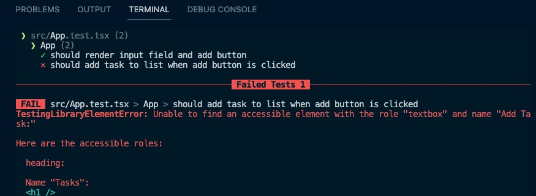

<VideoEmbed
  id="NmB18jfnGc0"
  title="Writing Tests | Todo App with React, TypeScript, TDD | Frontend Hire"
/>

Let us see where we are currently. Run the dev server and open the respective dev URL, as Vite shows in your browser.

```sh
npm run dev
```

Also, buckle up. This section is going to be a long ride.

## Render Test

As frontend developers, we find it easier to work with visible things. We already know that the component is visible in the browser.

But why do we even need to test it? Writing tests for this seems futile. Right now, the component is straightforward. But, as the component grows, it will become more complex and we cannot be sure that any new changes will not cause regressions.

So, writing tests to confirm our current behavior is a good idea. Let us write a test to verify that the input and button are rendering in the browser.

### Test Structure

Create a new `App.test.tsx` file in the `src` folder. This file will pretty much contain the tests for the entire App component.

```tsx title="./src/App.test.tsx"
// [!code ++:5]
import { describe, test } from 'vitest';

describe('App', () => {
  test('should render input field and add button', () => {});
});
```

We previously wrote a sample test for the `sum` function. Every test should have a meaningful name. The test name should describe what the test is doing. In this case, we are testing if the App component renders the input field and the add button. (read more about [test API here](https://vitest.dev/api/#test))

Describe is used to group tests. It is not necessary to use describe, but it is good practice to group tests. It helps organize the tests and debug them. (read more about [describe API here](https://vitest.dev/api/#describe))

### Render Component for Testing

We need to render the component in the test. We can use the `render` function from `@testing-library/react` to render the component. (read more about [render API here](https://testing-library.com/docs/react-testing-library/api#render))

```tsx title="./src/App.test.tsx" {2-3,7}
import { describe, test } from 'vitest';
// [!code ++:2]
import { render } from '@testing-library/react';
import App from './App';

describe('App', () => {
  test('should render input field and add button', () => {
    render(<App />); // [!code ++]
  });
});
```

### Query the DOM

We need to query the DOM to check if the input field and the button are present.

We can use various queries. In general, following the guidelines of RTL (read the [priority here](https://testing-library.com/docs/queries/about#priority)) for the query priority order is a good idea.

To summarise at a high level, we need to use the queries closest to the user. In our case:

- We'll use `getByRole` to query the input and the button.

```tsx title="./src/App.test.tsx"
import { describe, expect, test } from 'vitest';
import { render, screen } from '@testing-library/react';
import App from './App';

describe('App', () => {
  test('should render input field and add button', () => {
    render(<App />);

    // [!code ++:2]
    const input = screen.getByRole('textbox', { name: 'Add Task:' });
    const button = screen.getByRole('button', { name: 'Add' });
  });
});
```

### Assert

We have the elements. Now, we need to assert that they are present in the DOM. We can use the `expect` function from `vitest` to assert. (read more about [expect API here](https://vitest.dev/api/expect.html#expect))

And also, use the `toBeDefined` matcher to check if the element is defined. (read more about [toBeDefined matcher here](https://vitest.dev/api/expect.html#tobedefined))

```tsx title="./src/App.test.tsx"
import { describe, expect, test } from 'vitest';
import { render, screen } from '@testing-library/react';
import App from './App';

describe('App', () => {
  test('should render input field and add button', () => {
    render(<App />);

    const input = screen.getByRole('textbox', { name: 'Add Task:' });
    const button = screen.getByRole('button', { name: 'Add' });

    // [!code ++:2]
    expect(input).toBeDefined();
    expect(button).toBeDefined();
  });
});
```

### Run the Test

Now, run the test and see if it passes.

```sh
npm run test
```

The test should pass with an output like this:


### Improving the Test

Now, `toBeDefined` is not the best matcher to use here. We can use `toBeInTheDocument` matcher from `@testing-library/jest-dom` to check if the element is present in the DOM. (read more about [toBeInTheDocument matcher here](https://testing-library.com/docs/queries/about#priority))

- Read [this StackOverflow answer here](https://stackoverflow.com/questions/73783371/difference-between-tobeinthedocument-and-tobedefined) to understand the difference between `toBeDefined` and `toBeInTheDocument`.

So, let us install `@testing-library/jest-dom` and use the `toBeInTheDocument` matcher.

```sh
npm install -D @testing-library/jest-dom
```

We will import the `vitest` compatible version of `@testing-library/jest-dom` from `@testing-library/jest-dom/vitest`. (read more about [vitest compatible version here](https://github.com/testing-library/jest-dom?tab=readme-ov-file#with-vitest))

And it would import the entire thing.

```tsx title="./src/App.test.tsx"
import { describe, expect, test } from 'vitest';
import { render, screen } from '@testing-library/react';
import '@testing-library/jest-dom/vitest'; // [!code ++]
import App from './App';

describe('App', () => {
  test('should render input field and add button', () => {
    render(<App />);
    const input = screen.getByRole('textbox', { name: 'Add Task:' });
    const button = screen.getByRole('button', { name: 'Add' });

    // [!code highlight:2]
    expect(input).toBeInTheDocument();
    expect(button).toBeInTheDocument();
  });
});
```

Rerun the test, and it should pass.

The `jest-dom` import (line 3 in the above snippet) usually happens in a separate setup file for all the tests in our application. We will do that now as a good practice.

Create a new file, `setupTests.ts`, at the project's root and add the import.

```ts title="./setupTests.ts"
import '@testing-library/jest-dom/vitest'; // [!code ++]
```

And remove the import from the test file.

```tsx title="./src/App.test.tsx"
import { describe, expect, test } from 'vitest';
import { render, screen } from '@testing-library/react';
import '@testing-library/jest-dom/vitest'; // [!code --]
import App from './App';

describe('App', () => {
  test('should render input field and add button', () => {
    render(<App />);
    const input = screen.getByRole('textbox', { name: 'Add Task:' });
    const button = screen.getByRole('button', { name: 'Add' });

    expect(input).toBeInTheDocument();
    expect(button).toBeInTheDocument();
  });
});
```

We must also update our `vite.config.ts` to use this setup file. (read more about [setup files here](https://vitest.dev/config/#setupfiles))

```tsx title="./vite.config.ts"
/// <reference types="vitest" />
import { defineConfig } from 'vite';
import react from '@vitejs/plugin-react';

// https://vitejs.dev/config/
export default defineConfig({
  plugins: [react()],
  test: {
    environment: 'jsdom',
    setupFiles: './setupTests.ts', // [!code ++]
  },
});
```

Rerun the test, and it should pass. But you'll see an error related to TypeScript despite the test passing.


This error is because TypeScript does not include the `setupTests.ts` file in our project. Let's update our `tsconfig.json` to include this file.

```json title="./tsconfig.json"
{
  "compilerOptions": {
    /* Some of the options omitted for brevity */
  },
  "include": ["src", "./setupTests.ts"], // [!code highlight]
  "references": [{ "path": "./tsconfig.node.json" }]
}
```

Save the file, and the error should go away.

Great, we wrote our first test, which actually made sense to test. But we are not done yet. We need to test the functionality of the component further.

Before we move on, let us use an eslint plugin to help us write better tests. Install `eslint-plugin-testing-library` and `eslint-plugin-jest-dom` as dev dependencies. These plugins will help us write better tests.

```sh
npm install -D eslint-plugin-testing-library eslint-plugin-jest-dom
```

And let us add them to our `.eslintrc.cjs` file.

```json title=".eslintrc.cjs"
module.exports = {
  /* Rest of the options omitted for brevity */
  extends: [
    'eslint:recommended',
    'plugin:@typescript-eslint/recommended',
    'plugin:react-hooks/recommended',
		// [!code ++:2]
    'plugin:jest-dom/recommended',
    'plugin:testing-library/react',
    'prettier',
  ],
  /* Rest of the options omitted for brevity */
};
```

## Testing the user interaction

Let us write a test to check if the user can add a task to the list.

```tsx title="./src/App.test.tsx"
import { describe, expect, test } from 'vitest';
import { render, screen } from '@testing-library/react';

import App from './App';

describe('App', () => {
  test('should render input field and add button', () => {
    render(<App />);
    const input = screen.getByRole('textbox', { name: 'Add Task:' });
    const button = screen.getByRole('button', { name: 'Add' });

    expect(input).toBeInTheDocument();
    expect(button).toBeInTheDocument();
  });

  // [!code ++]
  test('should add task to list when add button is clicked', () => {});
});
```

So, how can we test user interaction? If we look at the docs of `Testing Library`, you can see a section for `User Actions` under the `Core API` and a page for `Firing Events`. [Here's the exact link to the page](https://testing-library.com/docs/dom-testing-library/api-events).

Inputs are usually changed, and buttons are clicked. We pretty much end up with something like this:

```tsx title="./src/App.test.tsx"
import { describe, expect, test } from 'vitest';
import { render, screen, fireEvent } from '@testing-library/react'; // [!code ++]

import App from './App';

describe('App', () => {
  test('should render input field and add button', () => {
    render(<App />);
    const input = screen.getByRole('textbox', { name: 'Add Task:' });
    const button = screen.getByRole('button', { name: 'Add' });

    expect(input).toBeInTheDocument();
    expect(button).toBeInTheDocument();
  });

  test('should add task to list when add button is clicked', () => {
    // [!code ++:7]
    const input = screen.getByRole('textbox', { name: 'Add Task:' });
    const button = screen.getByRole('button', { name: 'Add' });

    fireEvent.change(input, { target: { value: 'New Task' } });
    fireEvent.click(button);

    expect(screen.getByText('New Task')).toBeInTheDocument();
  });
});
```

Now, if you run your tests, they should be passing! But a couple of things are not good here.

- First, we still use the old rendered component from the previous test. This old component can cause issues if we are not careful. So, we need to render a new component again.

```tsx title="./src/App.test.tsx"
import { describe, expect, test } from 'vitest';
import { render, screen, fireEvent } from '@testing-library/react';

import App from './App';

describe('App', () => {
  test('should render input field and add button', () => {
    render(<App />);
    const input = screen.getByRole('textbox', { name: 'Add Task:' });
    const button = screen.getByRole('button', { name: 'Add' });

    expect(input).toBeInTheDocument();
    expect(button).toBeInTheDocument();
  });

  test('should add task to list when add button is clicked', () => {
    render(<App />); // [!code ++]

    const input = screen.getByRole('textbox', { name: 'Add Task:' });
    const button = screen.getByRole('button', { name: 'Add' });

    fireEvent.change(input, { target: { value: 'New Task' } });
    fireEvent.click(button);

    expect(screen.getByText('New Task')).toBeInTheDocument();
  });
});
```

You might try doing something like the above! But that will fail the tests with this error:


The error might be intimidating at first, but it is constructive. It tells us that there are multiple elements with the exact text. This error happened because we did not `clean up` our first test's render. So, the second render had the first test's elements as well. So, we must clean up the first render and subsequent renders.

```tsx title="./src/App.test.tsx" {1-2, 6}
// [!code highlight:2]
import { describe, expect, test, afterEach } from 'vitest';
import { render, screen, fireEvent, cleanup } from '@testing-library/react';

import App from './App';

afterEach(cleanup); // [!code highlight]

describe('App', () => {
  test('should render input field and add button', () => {
    render(<App />);
    const input = screen.getByRole('textbox', { name: 'Add Task:' });
    const button = screen.getByRole('button', { name: 'Add' });

    expect(input).toBeInTheDocument();
    expect(button).toBeInTheDocument();
  });

  test('should add task to list when add button is clicked', () => {
    render(<App />);

    const input = screen.getByRole('textbox', { name: 'Add Task:' });
    const button = screen.getByRole('button', { name: 'Add' });

    fireEvent.change(input, { target: { value: 'New Task' } });
    fireEvent.click(button);

    expect(screen.getByText('New Task')).toBeInTheDocument();
  });
});
```

Now, our ESLint rules would complain that:
`cleanup is performed automatically by your test runner, you don't need manual cleanups.`

You can read more about this here, figure out why, and find a solution. [Here's the link](https://testing-library.com/docs/react-testing-library/api#cleanup)

In short, ESLint assumes we have a global `afterEach` declared. But we do not! There are multiple ways to fix this issue. We will solve it by moving our clean-up logic to the global setup file.

```ts title="./setupTests.ts"
import '@testing-library/jest-dom/vitest';
// [!code ++:2]
import { cleanup } from '@testing-library/react';
import { afterEach } from 'vitest';

afterEach(cleanup); // [!code ++]
```

And clean up our `./src/App.test.tsx` file

```tsx title="./src/App.test.tsx"
import { describe, expect, test } from 'vitest';
import { render, screen, fireEvent } from '@testing-library/react';

import App from './App';

describe('App', () => {
  test('should render input field and add button', () => {
    render(<App />);
    const input = screen.getByRole('textbox', { name: 'Add Task:' });
    const button = screen.getByRole('button', { name: 'Add' });

    expect(input).toBeInTheDocument();
    expect(button).toBeInTheDocument();
  });

  test('should add task to list when add button is clicked', () => {
    render(<App />);

    const input = screen.getByRole('textbox', { name: 'Add Task:' });
    const button = screen.getByRole('button', { name: 'Add' });

    fireEvent.change(input, { target: { value: 'New Task' } });
    fireEvent.click(button);

    expect(screen.getByText('New Task')).toBeInTheDocument();
  });
});
```

This change is also good because we are not repeating the same code in every test, and even if someone forgets to clean up, it will be taken care of.

Now, run the tests, and they should pass. But there is still a problem:

- To amplify the problem significantly, let us make the input field `readonly` and see if our tests still pass.

```tsx title="./src/App.tsx"
// Rest of the code omitted for brevity

function App() {
  // Some of the code omitted for brevity

  return (
    <div>
      {/* Some of the code omitted for brevity */}
      <input
        readOnly // [!code ++]
        id="task-input"
        value={taskName}
        onChange={(e) => setTaskName(e.target.value)}
      />
      {/* Some of the code omitted for brevity */}
    </div>
  );
}

// Rest of the code omitted for brevity
```

Our tests will still pass! But, we know that the user cannot type in the input field. What we have right now is a false positive.

We could have avoided this problem by testing user interaction differently. Even the docs recommend another library called `user-event` for testing user interaction. [Here's the link to the docs](https://testing-library.com/docs/user-event/intro)

Let us install `user-event` and use it in our tests.

```sh
npm install -D @testing-library/user-event
```

Since user interactions are asynchronous, we need to use `async`, `await`, and `waitFor` from `@testing-library/react` for the changes to take effect. (read more about [async methods](https://testing-library.com/docs/dom-testing-library/api-async))

```tsx title="./src/App.test.tsx"
import { describe, expect, test } from 'vitest';
// [!code highlight:2]
import { render, screen, waitFor } from '@testing-library/react';
import userEvent from '@testing-library/user-event';

import App from './App';

describe('App', () => {
  test('should render input field and add button', () => {
    render(<App />);
    const input = screen.getByRole('textbox', { name: 'Add Task:' });
    const button = screen.getByRole('button', { name: 'Add' });

    expect(input).toBeInTheDocument();
    expect(button).toBeInTheDocument();
  });

  test('should add task to list when add button is clicked', async () => {
    const user = userEvent.setup(); // [!code ++]
    render(<App />);

    const input = screen.getByRole('textbox', { name: 'Add Task:' });
    const button = screen.getByRole('button', { name: 'Add' });

    // [!code highlight:2]
    await user.type(input, 'New Task');
    await user.click(button);

    // [!code highlight:3]
    await waitFor(() => {
      expect(screen.getByText('New Task')).toBeInTheDocument();
    });
  });
});
```

Our tests **should fail**. Because we are using `readOnly` on the input field, remove the `readOnly` prop from the input field and rerun the tests.

```tsx title="./src/App.tsx"
// Rest of the code omitted for brevity

function App() {
  // Some of the code omitted for brevity

  return (
    <div>
      {/* Some of the code omitted for brevity */}
      <input
        readOnly // [!code --]
        id="task-input"
        value={taskName}
        onChange={(e) => setTaskName(e.target.value)}
      />
      {/* Some of the code omitted for brevity */}
    </div>
  );
}

// Rest of the code omitted for brevity
```

Our tests should pass now. We also have a more robust test for user interaction.

Now, we have made a decent amount of progress on tests. Remember where we left our actual business logic? In the next section, let us return to that with `TDD` (Test Driven Development).

At this point, your code should be a good match to the branch of the repository: [5-writing-tests](https://github.com/Frontend-Hire/todo-app-react-tdd-typescript/tree/5-writing-tests)
