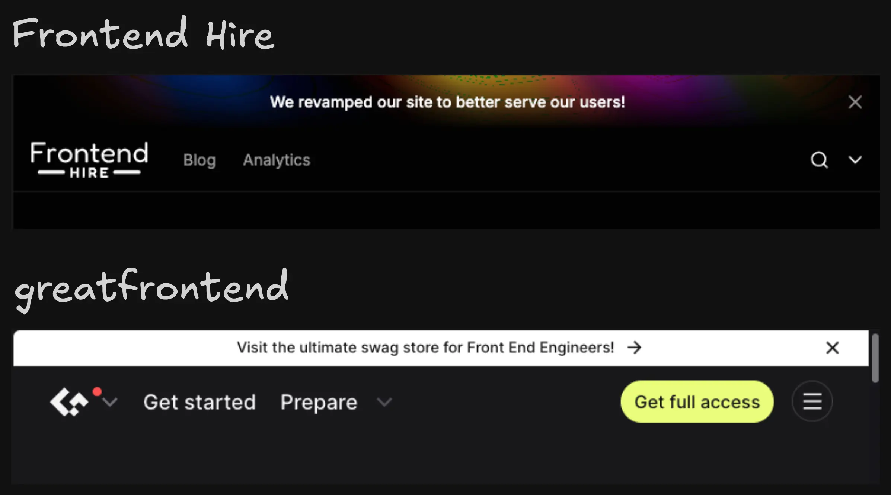

The banner component provides a flexible and reusable way to display important messages to users ranging from announcements and alerts to promotional content.

## Real World Examples

## Component API (covered in detail in the next chapter)

Some of the key questions the API will address:

- **Closable?** Should the banner allow users to dismiss it?
- **Persistent?** Should the banner persist across page reloads?
- **Layout?** Should the banner account for the height of the header and push the content below it?
- **Rotating Messages?** Should the banner support multiple messages? Should it cycle through multiple messages automatically or on user action?

The GitHub repo for this series is [here](https://github.com/Frontend-Hire/refactoring-profile-page).
