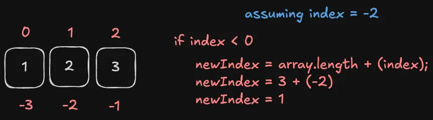

<VideoEmbed
  id="-50lMKXHjdk"
  title="Polyfill: Array.at() Method | JavaScript Coding | Medium Practice Question | Frontend Hire"
/>

TDD (test-driven development) shines in this type of scenario. We will also use the same approach here.

## Tests

Let us first write the tests for the following cases:

### The method returns `undefined` for an index that is out of the array's bounds

Handling this first helps handle edge cases early on.

```js title="index.test.js"
test('it returns undefined if index is out of bounds', () => {
  expect([1, 2, 3].myAt(5)).toBe(undefined);

  expect([1, 2, 3].myAt(-5)).toBe(undefined);
});
```

This test should automatically pass since the method does not return anything at the moment.

### The method returns the correct item for a positive index

```js title="index.test.js"
test('it returns the element at the given positive index', () => {
  expect([1, 2, 3].myAt(1)).toBe(2);

  expect([1, 2, 3].myAt(2)).toBe(3);
});
```

### The method returns the correct item for a negative index

```js title="index.test.js"
test('it returns the element at the given negative index', () => {
  expect([1, 2, 3].myAt(-1)).toBe(3);

  expect([1, 2, 3].myAt(-2)).toBe(2);
});
```

Putting them all together:

```js title="index.test.js"
import { describe, test, beforeAll, expect } from 'vitest';

import { myAt } from '.';

describe('polyfill-array-at', () => {
  beforeAll(() => {
    Array.prototype.myAt = myAt;
  });

  test('it returns undefined if index is out of bounds', () => {
    expect([1, 2, 3].myAt(5)).toBe(undefined);

    expect([1, 2, 3].myAt(-5)).toBe(undefined);
  });

  test('it returns the element at the given positive index', () => {
    expect([1, 2, 3].myAt(1)).toBe(2);

    expect([1, 2, 3].myAt(2)).toBe(3);
  });

  test('it returns the element at the given negative index', () => {
    expect([1, 2, 3].myAt(-1)).toBe(3);

    expect([1, 2, 3].myAt(-2)).toBe(2);
  });
});
```

## The Polyfill

<Callout type="error">
  The actual implementation would be different from what we implement here. This
  is because for an interview setting this is more than enough. But if you were
  actually implementing a JS polyfill for production (quite rare), you would
  need to check the actual specification and handle more edge cases than what
  you see here.
</Callout>

So, what does the regular array accessing do?

```js
export function myAt(index) {
  return this[index];
}
```

This already passes the undefined and positive index tests.

The only issue is the negative index test. We need to do some extra work to make it work.

The logic is quite simple. We just have to recalculate the index based on the length of the array and the negative index but only when the index is negative. So, a simple if statement should do it.



```js
export function myAt(index) {
  if (index < 0) {
    return this[this.length + index];
  }

  return this[index];
}
```
