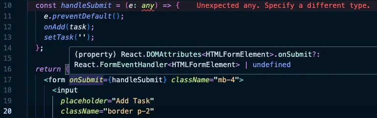
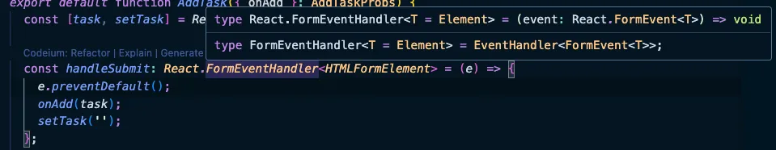

<VideoEmbed
  id="1WwsAMl2MkQ"
  title="TypeScript: Migrate useState-1 | React Coding | Easy Practice Question | Frontend Hire"
/>

<Callout>
Though we are a huge fan of text-based learning, sometimes we need to go for a video for a better experience. This is one of those times. We still tried to give you as much as possible in text.

**Watch the video for a better experience.**

</Callout>

We will only discuss the TypeScript part of the solution. The other logical solution is already covered in the [JS version of the question](/questions/react/coding/use-state-1).

The way we like to approach migration to TypeScript in React is to handle the child components first and then move up to the parent component.

In our case, the component tree looks something like this:

```md
- main
  - App
    - AddTask
    - Task
```

So, we can work on the `AddTask` or `Task` component first.

<Callout type='warn'>
If you feel like something is not working as expected with TypeScript, just try to restart the TypeScript server.

**This is how you do it in VSCode:**

- Open the Command Palette:

  - For **Mac**: Press <kbd>Cmd</kbd> + <kbd>Shift</kbd> + <kbd>P</kbd>
  - For **Windows**: Press <kbd>Ctrl</kbd> + <kbd>Shift</kbd> + <kbd>P</kbd>

- Type "**TypeScript: Restart TS Server**"
- Select the command from the list

This will restart the TypeScript server, which can often resolve unexpected behavior or issues with TypeScript in VSCode.

Sometimes a restart to the dev server might also be needed.

**Watch the video for a better experience.**

</Callout>

## Migrating Task component

First, rename the `Task.jsx` file to `Task.tsx`.

Your code editor should light up with red lines. Especially at the part where props are destructured.

Ok, so how do we define the props?

We can either use a `type` or `interface` (type is the preferred way for props at least but both will work the same in most cases):

```tsx title="Task.tsx"
// [!code highlight:5]
type TaskProps = {
  task: any;
  idx: any;
  onDelete: any;
};

// [!code highlight]
export default function Task({ task, idx, onDelete }: TaskProps) {
  return (
    <div className="my-2 flex items-center">
      <p className="border border-blue-500 p-2">
        {idx + 1}: {task.taskName}
      </p>
      <button
        onClick={onDelete}
        className="border border-red-500 bg-red-500 p-2 text-white"
      >
        Delete
      </button>
    </div>
  );
}
```

So, we said to the `Task` component that it can take three props: `task`, `idx`, and `onDelete` using our `TaskProps` type. For now, we said that all these types can be anything (any, not a good idea).

At least, the red lines are gone from the `Task` component. But our TypeScript config tells us to not use `any` types. Of course, because using `any` for the types defeats the purpose of TypeScript. Let us narrow down the type of props to the ones we need.

The `task` property from the use of it in the component we can see that it is an `object` with the property `taskName`. So, we can narrow it down to something like this:

```ts
type TaskProps = {
  // [!code highlight:3]
  task: {
    taskName: string;
  };
  idx: any;
  onDelete: any;
};
```

What about the `idx` property? It is a number. So, we can directly narrow it down to `number`:

```ts
type TaskProps = {
  task: {
    taskName: string;
  };
  // [!code highlight]
  idx: number;
  onDelete: any;
};
```

What about the `onDelete` property? It is a function that takes no arguments and returns nothing (**void** is the type for nothing in TypeScript). So, we can directly narrow it down to `() => void`:

```ts
type TaskProps = {
  task: {
    taskName: string;
  };
  idx: number;
  // [!code highlight]
  onDelete: () => void;
};
```

Perfect, no more red lines. Now, we can work on the `AddTask` component.

## Migrating AddTask component

Same as the `Task` component, we can rename the `AddTask.jsx` file to `AddTask.tsx`.

This time, we see more red lines. One of them is at the usual props destructuring while the other is at the `handleSubmit` function definition.

Let us use `any` and make these red lines disappear for now and let TypeScript warn us about the `any` type.

```tsx title="AddTask.tsx"
import React from 'react';

// [!code highlight:3]
type AddTaskProps = {
  onAdd: any;
};

// [!code highlight]
export default function AddTask({ onAdd }: AddTaskProps) {
  const [task, setTask] = React.useState('');

  // [!code highlight]
  const handleSubmit = (e: any) => {
    e.preventDefault();
    onAdd(task);
    setTask('');
  };

  return (
    <form onSubmit={handleSubmit} className="mb-4">
      <input
        placeholder="Add Task"
        className="border p-2"
        value={task}
        onChange={(e) => setTask(e.target.value)}
      />
      <button
        type="submit"
        className="border border-green-500 bg-green-500 p-2 text-white"
      >
        Add
      </button>
    </form>
  );
}
```

Just like the `onDelete` property in the `Task` component, we can narrow down the type of `onAdd` to something like this:

```ts
type AddTaskProps = {
  // [!code highlight]
  onAdd: (task: string) => void;
};
```

This time we had to specify the parameter types because we are passing the `task` to the `onAdd` function.

Let us work on the `handleSubmit` function now. Let us check where are we passing this function in the markup.

```tsx
// [!code highlight]
<form onSubmit={handleSubmit} className="mb-4">
```

Hmm, hover over the `onSubmit` attribute and see what the editor is suggesting the type to be.



The suggestion is it could be of type `React.FormEventHandler<HTMLFormElement>`. Let us use this suggestion and see what happens.

You will see more errors in the console, to be specific the following errors:

```ts
Property 'preventDefault' does not exist on type 'FormEventHandler<HTMLFormElement>'.ts(2339)
```

```ts
Type '(e: React.FormEventHandler<HTMLFormElement>) => void' is not assignable to type 'FormEventHandler<HTMLFormElement>'.
  Types of parameters 'e' and 'event' are incompatible.
    Type 'FormEvent<HTMLFormElement>' is not assignable to type 'FormEventHandler<HTMLFormElement>'.
      Type 'FormEvent<HTMLFormElement>' provides no match for the signature '(event: FormEvent<HTMLFormElement>): void'.ts(2322)
index.d.ts(2417, 9): The expected type comes from property 'onSubmit' which is declared here on type 'DetailedHTMLProps<FormHTMLAttributes<HTMLFormElement>, HTMLFormElement>'
```

What the hell are these errors? But if we do try to read the errors it might help us to understand what is going on.

Still difficult? Here is what's wrong:

We assigned the type of `e` to `React.FormEventHandler<HTMLFormElement>`, but whereas what the editor suggested is that the type of the entire function is `React.FormEventHandler<HTMLFormElement>` and **not** for the actual `e` parameter. To solve this, we just to move the type:

```ts
// [!code highlight]
const handleSubmit: React.FormEventHandler<HTMLFormElement> = (e) => {
  e.preventDefault();
  onAdd(task);
  setTask('');
};
```

But if you want to only type the parameter, we can now hover over the type again and see what the editor is suggesting the type of `e` be.



Get it? We were using the wrong type for the parameter `e` previously. But now we have a better idea. We could now refactor the function to this:

```ts
// [!code highlight]
const handleSubmit = (e: React.FormEvent<HTMLFormElement>) => {
  e.preventDefault();
  onAdd(task);
  setTask('');
};
```

<Callout>
We will do more questions on Generics (the React.FormEvent\<HTMLFormElement\> syntax) to understand them better. But at a high level, these are similar to how regular functions work. You can pass types as parameters to other types.
</Callout>

Here comes the interesting part: The `App` component.

## Migrating App component

Again, let us rename the `App.jsx` file to `App.tsx`.

Quite a few errors. But let us work on the functions `addTask` and `deleteTask` as these were already typed well in the child components.

We know that the `addTask` just receives a parameter `task` as `string` and returns nothing. So, we can type it like this:

```ts
// [!code highlight]
const addTask = (task: string) => {
  // Omitted for brevity
};
```

We will come to the other error within this function soon. But for now, let us worry about the `deleteTask` function.

We know that the `deleteTask` just receives a parameter `idx` as `number` and returns nothing. So, we can type it like this:

```ts
// [!code highlight]
const deleteTask = (id: number) => {
  setTasks(tasks.filter((task) => task.id !== id));
};
```

Great, now we have a single error to work on which is at:

```ts
setTasks([...tasks, newTask]);

// ERROR MESSAGE 1:
Type '{ id: string; taskName: string; }' is not assignable to type '{ id: number; taskName: string; }'.ts(2322)

// ERROR MESSAGE 2:
Type '{ id: number; taskName: string; } | { id: string; taskName: string; }' is not assignable to type '{ id: number; taskName: string; }'.
  Type '{ id: string; taskName: string; }' is not assignable to type '{ id: number; taskName: string; }'.
    Types of property 'id' are incompatible.
      Type 'string' is not assignable to type 'number'.ts(2322)
```

But these errors are why TypeScript is so awesome. The issue coming because our `tasks` state inferred the following type due to the default value:

```ts
const tasks: {
  id: number;
  taskName: string;
}[];
```

But in the `addTask` function, we are trying to add a task that has an `id` that is a string. So, we more of have a potential bug in the app. Let us fix it:

```ts
const addTask = (task: string) => {
  const trimmedTask = task.trim();

  if (!trimmedTask) {
    return;
  }

  const newTask = {
    // [!code highlight]
    id: +Math.random().toString(36).substr(2, 9),
    taskName: trimmedTask,
  };

  setTasks([...tasks, newTask]);
};
```

There is still one issue that TypeScript is not complaining about.


It is technically not an issue. But can easily end up being one. We can see that having a dedicated type for `task` might be a good idea and we can share this across all the components that use it.

Let us create a file called `types.ts` and export the `Task` type:

```ts title="types.ts"
export type Task = {
  id: number;
  taskName: string;
};
```

We can now refer to this type wherever we use it.

```ts title="App.tsx" showLineNumbers
import React from 'react';
import AddTask from './AddTask';
import Task from './Task';
// [!code highlight]
import type { Task as TaskType } from './assets/types';

export default function App() {
  // [!code highlight]
  const [tasks, setTasks] = React.useState<TaskType[]>([
    { id: 1, taskName: 'First Task' },
  ]);

  // REST OF THE CODE OMITTED FOR BREVITY
}
// REST OF THE CODE OMITTED FOR BREVITY
```

See how the `React.useState` can use the type information on top of its initial signature? This is possible because of the generic type.

```ts title="Task.tsx"
// [!code highlight]
import type { Task as TaskType } from './assets/types';

type TaskProps = {
  // [!code highlight]
  task: TaskType;
  idx: number;
  onDelete: () => void;
};

// REST OF THE CODE OMITTED FOR BREVITY
```

Great, now we have a single source of truth for the `Task` type.

There is just one file left: `main.jsx`.

## Migrating main.jsx

Same as before, let us rename the file from `main.jsx` to `main.tsx`.

There should just be a single error now.

```ts
ReactDOM.createRoot(document.getElementById('root')).render(
  <React.StrictMode>
    <App />
  </React.StrictMode>,
);

// TS ERROR
Argument of type 'HTMLElement | null' is not assignable to parameter of type 'Container'.
  Type 'null' is not assignable to type 'Container'.ts(2345)
```

Let us try to understand this error.

The `ReactDOM.createRoot` function takes a `Container` as its first parameter which essentially expects a DOM element. But document.getElementById can return null if the element is not found. There is literally no way to check for type safety here and we have to just tell TypeScript to trust us and believe that this type is not null.

We can tell TypeScript to trust us that this will never be null by using the `!` operator (called a Non-null assertion operator).

```ts
// [!code highlight]
ReactDOM.createRoot(document.getElementById('root')!).render(
  <React.StrictMode>
    <App />
  </React.StrictMode>,
);
```

<Callout type="error">
  Remember if you are using the `!` operator make sure to guarantee that this
  will never be null. Otherwise, TypeScript won't be able to help you out.
</Callout>

That wraps up this TypeScript migration.
