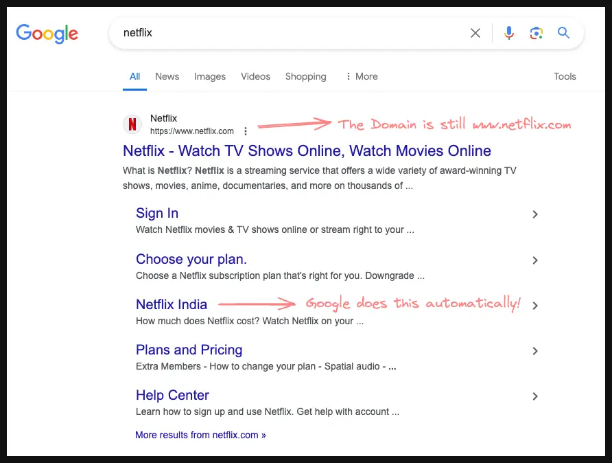
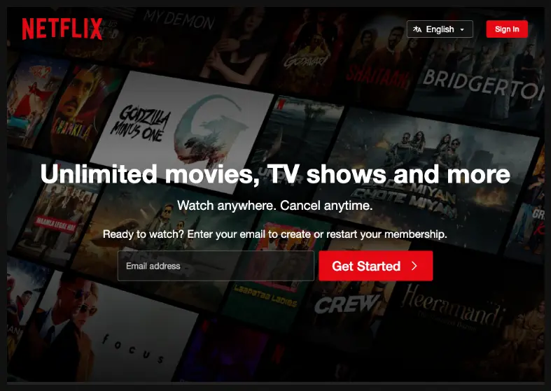
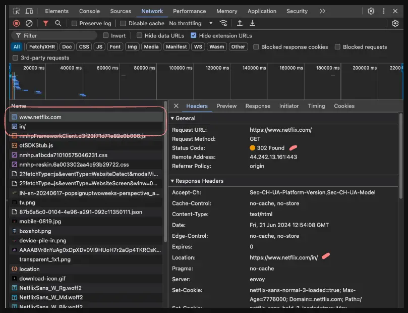

## What is Geo Redirection?

This [service's landing page](https://geotargetly.com/geo-redirect) summarizes this concept pretty well.

But in a nutshell, Geo Redirection is a service that allows you to redirect users based on their location. We could either redirect or show a prompt to let users manually redirect.

### Example: Netflix

Let us start by searching Netflix on Google.

The domain is www.netflix.com, but immediately you see a relevant site link `Netflix India` (you might see a different link based on where you are located. We are located in India). So, is this what Geo Redirection is? No, this has nothing to do with Geo Redirection. This sitelink is automatically generated by Google (not even Netflix has control over this). Google has an algorithm for generating these [sitelinks](https://developers.google.com/search/docs/appearance/sitelinks). The only thing Netflix can do is have such links in their sitemap hoping Google will pick them up.

Let us now click on the main link `www.netlfix.com` and see what happens.

If you follow TV or Movie entertainment, you will identify a couple of regional images on the landing page. This is where Geo Redirection comes in. Though you clicked on `www.netflix.com`, the current URL is something different, in our case it is `www.netflix.com/in`.

If you inspect the network requests, you'll see this redirection happen with a [`302 status code`](https://developer.mozilla.org/en-US/docs/Web/HTTP/Status/302).

#### What does the 302 status code mean?

> A browser redirects to this page but search engines don't update their links to the resource (in 'SEO-speak', it is said that the 'link-juice' is not sent to the new URL). - mdn web docs

If that mdn web docs definition is not clear, then you can simply understand it as "A is not available for now, so we will redirect to B".

#### So, how is Netflix doing this?

They could have their own solution or use another service that helps with this. But the concept is simple, get the user location through IP Address and redirect to the right location.

This approach of changing the URL means you can show an entirely new landing page for each location. These pages could be entirely static or dynamic.

A lot of global companies do this. Try to use [Amazon.com](https://amazon.com/) from India or use [Amazon.in](https://amazon.in/) if you are not in India. You will see a pop-up asking you to use a different location. Companies approach this based on their business logic. But the fundamental concept is the same.

## Conclusion

We have discussed how Geo Redirection works. This approach is simply rendering a completely different URL based on the user's location. This approach has various benefits and gives greater control to companies that have teams based on geographic location.
