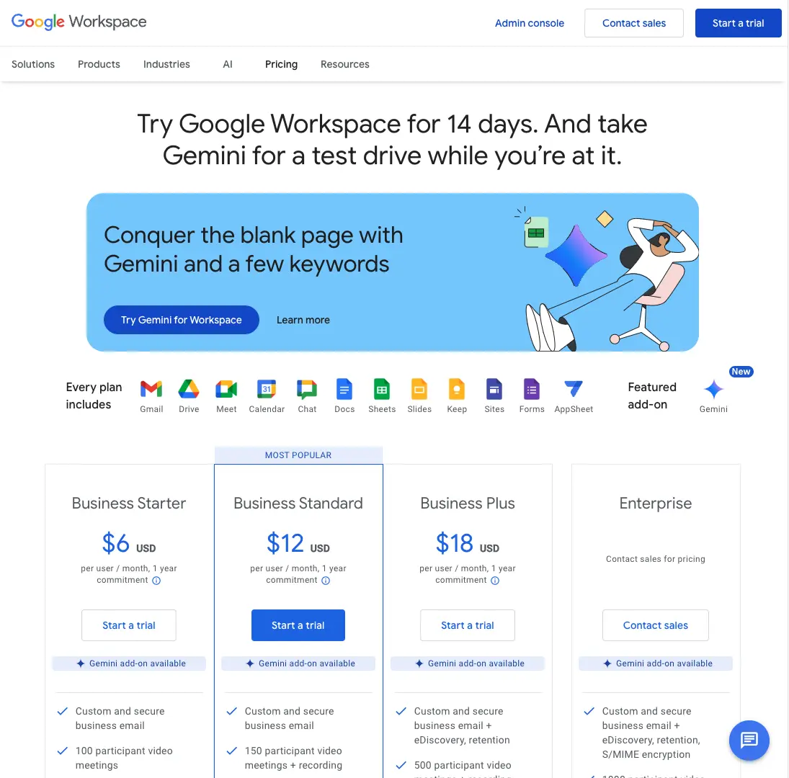
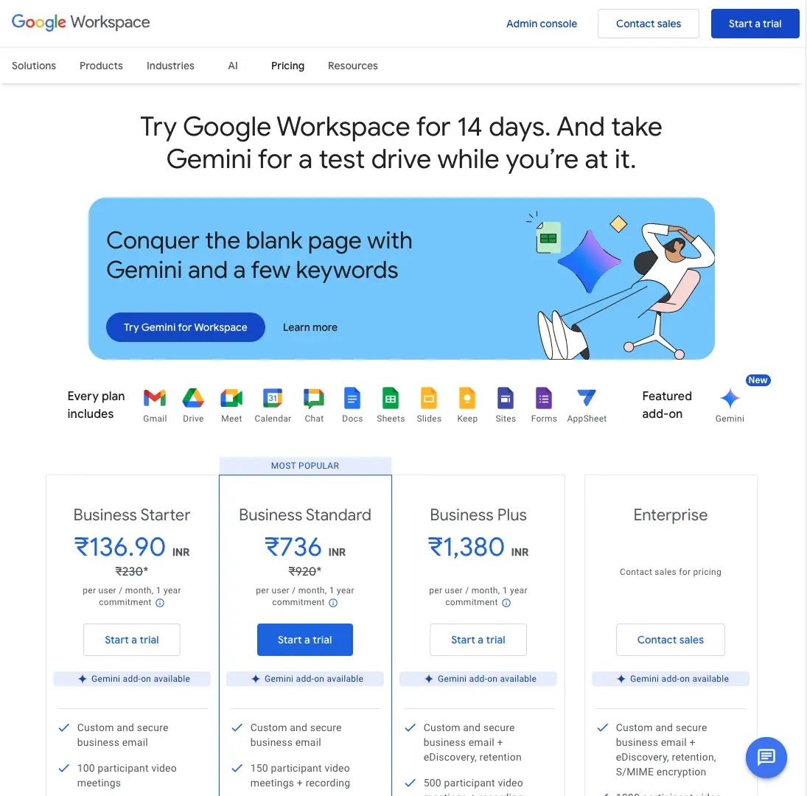

<Callout>
  We also have [a corresponding
  course](/learn/frontend/courses/dynamic-pricing-page/overview) where we
  implement a decent solution. Though, we would suggest you read this system
  design guide first.
</Callout>

## Problem

You must have seen a lot of pricing pages:

- Some show subscription plans.
- Some show one-time plans.
- Some show both subscription and one-time plans.

But have you seen the pricing pages that show regional pricing or pricing with purchase power parity?

Here is an example of [Google's Workspace pricing page](https://workspace.google.com/pricing) when viewed from the `Netherlands` (we used a VPN):

The same workspace pricing page when viewed from `India` (where Frontend Hire is based):

We thought they would show pricing in euros in the Netherlands. But either way, how is the same page showing different prices based on the user's location?

Also, the URL used in both cases is `https://workspace.google.com/pricing`. There is no additional information in the URL. So, how does this work?

<Callout>
  `Geotargeting` is the word used to describe this process of delivering content
  based on the user's location.
</Callout>

There are various ways to get the user's location:

- Using [Geolocation Web API](https://developer.mozilla.org/en-US/docs/Web/API/Geolocation_API)
  - This is provided by the browser and requires a user's permission to access their device location.
- Using Third-Party APIs
  - These APIs are third-party services that provide information about the user's location usually based on their IP address (IP address will always be available when a user makes a request).

Sounds simple but what are the implications of this? We will discuss this in the next section.
